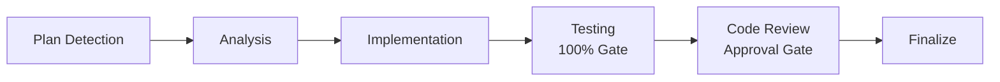

# VIBE Development Workflow

## 6-Step Cycle

## Steps

### Step 0: Plan Detection
- Find latest plan in `./plans`
- Auto-select next incomplete phase

### Step 1: Analysis
- Extract tasks from plan
- Map dependencies
- List ambiguities

### Step 2: Implementation
- Follow YAGNI/KISS/DRY
- Use `ui-ux-designer` for UI work
- Run type checking

### Step 3: Testing (100% GATE)
- Use `tester` subagent
- All tests must pass
- No commenting out tests

### Step 4: Code Review (BLOCKING)
- Use `code-reviewer` subagent
- Fix critical issues
- User must approve

### Step 5: Finalize
- Use `project-manager` to update plan
- Use `docs-manager` to update docs
- Auto-commit with message

## Integration

Use with `/code` or `/vibe-code` commands.

---

🚀 *VIBE: Visual IDE for Binh Pháp Excellence*
