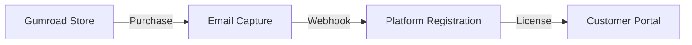

# 🏯 Binh Pháp Customer Funnel Strategy

> **"Dụng Gián" (Use Spies) - Use Gumroad as scout, Platform as base**

## 🎯 Objective: "Giữ Cá Trong Ao" (Keep Fish in Pond)

Transform one-time Gumroad buyers into recurring platform users.

## Phase 1: Scout (Gumroad)



### Actions:

1. Set up Gumroad webhook: `POST /api/webhooks/gumroad`
2. Auto-create platform account on purchase
3. Send welcome email with portal link

## Phase 2: Convert (Email Sequence)

| Day | Email             | Goal       |
| --- | ----------------- | ---------- |
| 0   | Welcome + License | Activation |
| 3   | Tutorial          | Engagement |
| 7   | Community invite  | Stickiness |
| 14  | Pro upsell        | Revenue    |
| 30  | Feedback request  | Product    |

// turbo
Run: `python3 scripts/email_sequence.py setup`

## Phase 3: Retain (Data Moat)

Build proprietary value that increases switching cost:

1. **Usage Analytics** - Personalized insights only on platform
2. **Community Access** - Discord/portal exclusive content
3. **Pro Features** - Advanced tools for subscribers
4. **Support Portal** - Priority support on platform

## Phase 4: Expand (Referral)

// turbo

```bash
# Check existing referral system
grep -r "referral" backend/ scripts/
```

Implement referral program:

- 20% commission for referrers
- Track via unique codes
- Auto-payout via PayPal

---

## WIN-WIN-WIN Check

| Party       | Win                              |
| ----------- | -------------------------------- |
| 👑 Anh      | Recurring revenue, lower CAC     |
| 🏢 Agency   | Customer data, platform control  |
| 🚀 Customer | Better support, community access |

---

## Implementation Commands

// turbo-all

```bash
# 1. Create webhook endpoint
cat > backend/api/routers/webhooks.py << 'EOF'
from fastapi import APIRouter, Request
router = APIRouter(prefix="/api/webhooks", tags=["webhooks"])

@router.post("/gumroad")
async def gumroad_webhook(request: Request):
    data = await request.json()
    # Process purchase, create account, send email
    return {"status": "received"}
EOF

# 2. Create email sequence config
mkdir -p config/email_sequences
echo '{"day_0": "welcome", "day_3": "tutorial", "day_7": "community", "day_14": "upsell"}' > config/email_sequences/post_purchase.json

# 3. Update main.py to include webhook router
echo "Adding webhook router..."
```

---

_Binh Pháp: "Bất chiến nhi khuất nhân chi binh" - Win without fighting_
