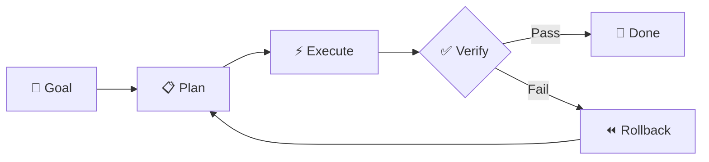

<p align="center">
  <picture>
    <source media="(prefers-color-scheme: dark)" srcset="https://img.shields.io/badge/🐉_MEKONG_CLI-0d1117?style=for-the-badge&labelColor=0d1117&color=0d1117">
    
  </picture>
</p>

<h1 align="center">
  Autonomous AI Agent Framework
</h1>

<p align="center">
  <em>Give it a goal. It plans. It executes. It verifies. Done.</em>
</p>

<p align="center">
  <a href="LICENSE"></a>
  <a href="https://github.com/longtho638-jpg/mekong-cli/actions"></a>
  
  
  
</p>

<p align="center">
  <a href="#quick-start">Quick Start</a> •
  <a href="#how-it-works">How It Works</a> •
  <a href="#agents">Agents</a> •
  <a href="#api">API</a> •
  <a href="#raas">RaaS</a> •
  <a href="CONTRIBUTING.md">Contribute</a>
</p>

---

## Why Mekong?

Most AI coding tools generate code and hope for the best. Mekong **plans**, **executes**, and **verifies** — then rolls back if anything breaks.

```
You say:  "Create a FastAPI service with JWT auth and tests"

Mekong:   ┌─ PLAN ────── LLM decomposes into 5 steps with dependencies
          ├─ EXECUTE ── Runs each step (shell, API, code generation)
          ├─ VERIFY ─── Validates: tests pass? types check? builds clean?
          └─ DONE ───── All green. 3 credits deducted. Ship it.
```

**Zero babysitting.** If verification fails, it auto-rolls back and retries.

## Quick Start

```bash
# Clone & install
git clone https://github.com/longtho638-jpg/mekong-cli.git
cd mekong-cli
pip install -e ".[dev]"

# Set your LLM (any OpenAI-compatible provider)
export LLM_BASE_URL="https://api.openai.com/v1"
export LLM_API_KEY="sk-..."

# 🚀 Go
mekong cook "Create a Python calculator with tests"
```

### Works with every LLM

| Provider | Config |
|----------|--------|
| **OpenAI** | `LLM_BASE_URL=https://api.openai.com/v1` |
| **Anthropic** | Via any compatible proxy |
| **Google Gemini** | `LLM_BASE_URL=https://generativelanguage.googleapis.com/v1beta/openai` |
| **DashScope (Qwen)** 🎁 | `LLM_BASE_URL=https://dashscope.aliyuncs.com/compatible-mode/v1` — [Free credits →](https://www.alibabacloud.com/campaign/benefits?referral_code=A9245T) |
| **Local (Ollama)** | `LLM_BASE_URL=http://localhost:11434/v1` |

## How It Works

### Plan → Execute → Verify (PEV)

The core loop that makes Mekong reliable:



| Phase | What | Module |
|-------|------|--------|
| **Plan** | LLM decomposes goal into ordered steps with dependency graph | `src/core/planner.py` |
| **Execute** | Runs shell commands, API calls, LLM prompts — in parallel where possible | `src/core/executor.py` |
| **Verify** | Checks exit codes, file existence, test results, LLM assessment | `src/core/verifier.py` |

## Agents

Pluggable agents extend Mekong with domain-specific capabilities:

```bash
mekong agent git status          # Git operations
mekong agent file find "*.py"    # File search & analysis
mekong agent shell "npm test"    # Shell execution with safety
mekong agent database query ...  # Database ops (connect, query, migrate)
mekong agent crawler scan        # Recipe discovery
mekong agent lead hunt           # Lead generation
mekong agent content write       # SEO content generation
```

All agents follow the same `plan() → execute() → verify()` pattern. [Build your own →](CONTRIBUTING.md)

## CLI

```bash
mekong cook  "Build a REST API"     # Full PEV pipeline
mekong plan  "Add OAuth support"    # Plan only (dry run)
mekong debug "Fix login bug"        # Debug analysis
mekong run   recipe.md              # Execute recipe file
mekong agent <name> <cmd>           # Run agent directly
mekong gateway                      # Start API server
mekong evolve                       # Self-improvement cycle
```

| Flag | Description |
|------|-------------|
| `--verbose` `-v` | Step-by-step execution details |
| `--dry-run` `-n` | Plan only, no execution |
| `--strict` | Fail on first verification error |
| `--json` `-j` | Machine-readable JSON output |

## API

Start the gateway: `mekong gateway --port 8000`

| Endpoint | Method | Description |
|----------|--------|-------------|
| `/health` | GET | Health check |
| `/cmd` | POST | Execute PEV pipeline |
| `/v1/tasks` | POST | Submit task (credits deducted) |
| `/v1/tasks/{id}` | GET | Poll task status |
| `/v1/tasks/{id}/stream` | GET | SSE real-time progress |
| `/v1/agents` | GET | List available agents |
| `/v1/agents/{name}/run` | POST | Invoke agent directly |
| `/v1/license/validate` | POST | Validate RaaS license key |
| `/v1/license/status` | GET | Get license status (masked) |
| `/billing/webhook` | POST | Polar.sh webhook |

### Security Middleware

- **License Verification**: `/v1/license/*` endpoints require valid `RAAS_LICENSE_KEY`
- **Rate Limiting**: Token bucket (100 req/min default, configurable per tier)
- **CORS**: Configured for cross-origin requests

## RaaS

**Revenue as a Service** — Open Core licensing with built-in credit billing:

### Security Features

- **License Gating**: Premium agents behind `RAAS_LICENSE_KEY` verification
- **SHA-256 Hashing**: Secure license key storage
- **Rate Limiting**: Token bucket algorithm prevents abuse
- **Tier-based Access**: FREE / PRO / ENTERPRISE

```python
from lib.raas-gate import requireLicense, LicenseError

try:
    requireLicense('CTO Auto-Pilot')
    # Premium feature unlocked
except LicenseError as e:
    print(f"License required: {e.code}")
```

### Premium Agents (License Required)

| Agent | Tier | Description |
|-------|------|-------------|
| `auto-cto-pilot` | PRO | Tự động tạo tasks theo Binh Pháp |
| `opus-strategy` | PRO | Strategic planning với Claude Opus |
| `opus-parallel` | PRO | Parallel agent orchestration |
| `opus-review` | PRO | Security & quality review |

### Core Agents (Open Source)

`planner`, `fullstack-developer`, `tester`, `code-reviewer`, `debugger`, `researcher`, `ui-ux-designer`, `docs-manager`, `project-manager`, `git-manager`

### SDK Usage

```python
from src.raas.sdk import MekongClient

client = MekongClient("https://api.your-raas.com", "mk_your_key")

# Submit task → auto-deducts credits
result = client.submit_task("Deploy a landing page")

# Stream real-time progress
for event in client.stream_task(result.task_id):
    print(f"Step {event['order']}: {event['title']}")
```

| Complexity | Credits | Example |
|-----------|---------|---------|
| Simple | 1 | Single file edit, git operation |
| Standard | 3 | Multi-step feature with tests |
| Complex | 5 | Full-stack feature + deployment |

## Architecture

```
mekong-cli/
├── src/                    # Core engine
│   ├── core/               # PEV pipeline (planner, executor, verifier)
│   ├── agents/             # Pluggable agent system
│   └── raas/               # Credit billing & SDK
├── apps/                   # Production services
│   ├── algo-trader/        # Trading engine (Fastify + BullMQ)
│   ├── openclaw-worker/    # Autonomous CTO brain (Tôm Hùm 🦞)
│   └── raas-gateway/       # Cloudflare Worker gateway
├── packages/               # Shared libraries
├── cli/                    # CLI entry point
├── recipes/                # Built-in task templates
├── docker/                 # Container configs
├── tests/                  # Test suite
├── docs/                   # Documentation
└── examples/               # Usage examples
```

## Development

```bash
pnpm install              # Install dependencies
pnpm run build            # Build all packages
pnpm run test             # Run test suite
pnpm run lint             # Lint check
```

## Contributing & Revenue Sharing

Contributors **share in the revenue** generated by AgencyOS usage of their code. This isn't charity — it's aligned incentives.

See [CONTRIBUTING.md](CONTRIBUTING.md) for:
- 💰 Revenue sharing program
- 📐 Code standards & architecture patterns
- 🔀 PR workflow

## Roadmap

- [x] PEV Engine (Plan → Execute → Verify)
- [x] Agent System (Git, File, Shell, Database, Lead, Content)
- [x] Credit Billing (SQLite + Polar.sh)
- [x] Multi-tenant isolation
- [x] Python SDK (sync + async)
- [x] DAG scheduler (parallel execution)
- [x] Multi-provider LLM support
- [x] Plugin system
- [ ] Plugin marketplace
- [ ] Web dashboard
- [ ] Community recipe registry
- [ ] npm/pip package publishing

## License

[MIT](LICENSE) — Use it, fork it, build on it.

---

<p align="center">
  <sub>Built with 🐉 by <a href="https://binhphap.io">Binh Phap Venture Studio</a></sub><br/>
  <sub><em>"Speed is the essence of war." — Sun Tzu, The Art of War</em></sub>
</p>
