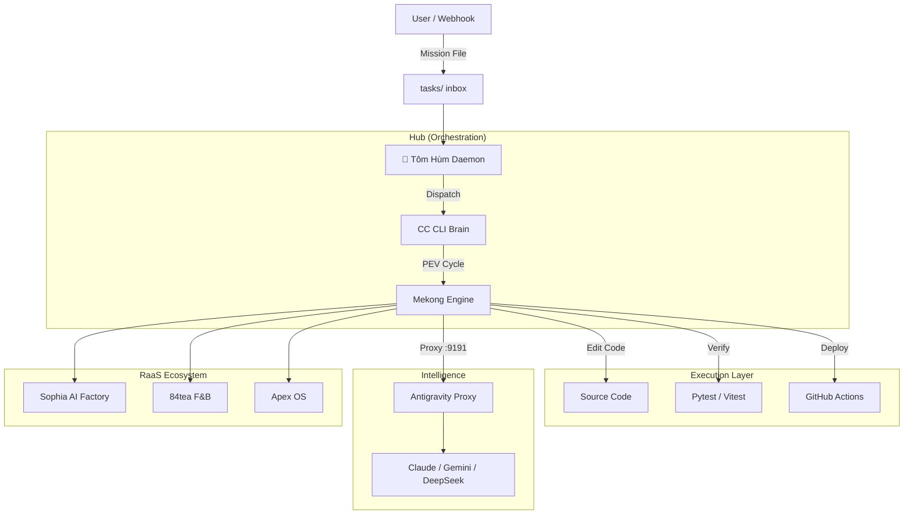

## 🌊 Mekong CLI — RaaS Agency Operating System

<div align="center">


**The Revenue-as-a-Service (RaaS) Foundation for Autonomous AI Agencies.**
*Transforming service models into high-precision execution engines.*

[🚀 Quick Start](#-quick-start) • [📦 Architecture](#-architecture) • [💎 RaaS Foundation](#-raas-foundation) • [🎯 Features](#-features) • [🤝 Contributing](#-contributing) • [🇻🇳 Tiếng Việt](README.vi.md)

</div>

---

## 📖 Introduction

**Mekong CLI** is the central nervous system for **Revenue-as-a-Service (RaaS)** agencies. Inspired by **The Art of War (孫子兵法)**, it orchestrates specialized AI agents to plan, execute, and verify complex engineering and business tasks with 100% precision.

It bridges the gap between high-level strategic goals and low-level code execution, ensuring that every "mission" is completed according to strict quality gates.

## 🎯 Key Features

### 🧠 Autonomous Execution Engine (PEV)
The core **Plan-Execute-Verify** workflow ensures systematic task handling:
- **Plan**: Deep multi-step decomposition using reasoning models (Opus 4.5, Gemini 2.0).
- **Execute**: Multi-mode execution (Shell, API, LLM) with self-healing capabilities.
- **Verify**: Strict **Binh Phap Quality Gates** (Type safety, No tech debt, Security audit).

### 🦞 Tôm Hùm (OpenClaw Daemon)
The autonomous orchestrator that keeps your agency running 24/7:
- **Autonomous Dispatch**: Watches `tasks/` directory and routes missions to specialized edge nodes.
- **Auto-CTO**: Proactively cleans code, fixes types, and audits security during idle time.
- **Hardware Awareness**: M1 thermal protection and RAM optimization for high-density edge deployments.

### ⚡ Antigravity Proxy
A unified LLM gateway (`port 9191`) for cost-effective intelligence:
- **Load Balancing**: Distributes load across Ollama, OpenRouter, and direct providers.
- **Failover**: Automatic model switching (e.g., Sonnet to Gemini) during quota limits.
- **Optimization**: Smart routing based on task complexity and budget.

---

## 📦 Architecture



---

## 📁 Monorepo — Danh sách dự án (`apps/`)

### Core Infrastructure
| App | Mô tả | Stack | Size | Status |
|-----|--------|-------|------|--------|
| `openclaw-worker` | Tôm Hùm daemon — autonomous task dispatch | Node.js | 1.0G | Active |
| `raas-gateway` | Cloud API gateway, Cloudflare Workers | Node.js | 739M | Active |
| `engine` | Core Python engine, Plan-Execute-Verify | Python, FastAPI | 900M | Active |
| `api` | Backend API service | Python, FastAPI | 767M | Active |
| `worker` | Background job processing | Node.js | 147M | Active |
| `antigravity-cli` | Antigravity CLI tools | Node.js | 16K | Scaffold |
| `antigravity-gateway` | Antigravity proxy gateway | Node.js | 44K | Scaffold |
| `gemini-proxy-clone` | Gemini proxy clone | Node.js | 4.5M | Active |

### Client Products
| App | Mô tả | Stack | Size | Status |
|-----|--------|-------|------|--------|
| `84tea` | Vietnamese tea franchise (MD3 brand) | Next.js, TS | 257M | Active ⭐ |
| `anima119` | Fermented Oriental medicine e-commerce | Next.js, TS | 1.4G | Active ⭐ |
| `apex-os` | Trading platform | Next.js, TS | 747M | Active ⭐ |
| `com-anh-duong-10x` | Restaurant POS + customer app | Next.js, TS | 1.0G | Active |
| `sophia-ai-factory` | Video SaaS, AI pipeline | Next.js, TS | 1.8G | Active ⭐ |
| `sophia-proposal` | Sales proposals, pitches | Next.js, TS | 1.0G | Archive |
| `sa-dec-flower-hunt` | Flower hunt game app | Next.js, TS | 120M | Archive |
| `well` | WellNexus health platform (symlink → archive) | Next.js, TS | 955M | Symlink |

### AgencyOS Platform
| App | Mô tả | Stack | Size | Status |
|-----|--------|-------|------|--------|
| `dashboard` | Main dashboard, client portal | Next.js, TS | 38M | Active |
| `admin` | Internal admin panel | Next.js, TS | 796K | Scaffold |
| `agencyos-web` | AgencyOS main web app | Next.js, TS | 1.5G | Active |
| `agencyos-landing` | Marketing landing page | Next.js, TS | 216M | Active |
| `landing` | Public landing page | Next.js, TS | 1.0M | Scaffold |
| `web` | Web frontend | Next.js, TS | 1.4M | Active |
| `analytics` | Analytics dashboard | Next.js, TS | 72M | Active |
| `developers` | Developer portal & docs | Next.js, TS | 14M | Active |
| `docs` | Documentation site | Next.js, TS | 35M | Active |

### Experimental / Support
| App | Mô tả | Stack | Size | Status |
|-----|--------|-------|------|--------|
| `algo-trader` | Algorithmic trading engine | Node.js, TS | 2.3M | Experimental |
| `agentic-brain` | Agentic AI brain research | Markdown, docs | 16K | Research |
| `stealth-engine` | Stealth execution engine | Node.js | 10M | Experimental |
| `vibe-coding-cafe` | Vibe coding environment | Mixed | 3.5M | Experimental |
| `raas-demo` | RaaS demo app | Next.js, TS | 420M | Demo |
| `starter-template` | Project template | Mixed | 156K | Template |
| `tasks` | Task queue (Tôm Hùm inbox) | Data | 100K | System |
| `project` | Build placeholder | Node.js | 24K | Scaffold |

> **Git Submodules:** `84tea`, `anima119`, `apex-os`, `sophia-ai-factory`, `gemini-proxy-clone`
> **Symlink:** `well` → `~/archive-2026/Well`

---

## 💎 RaaS Foundation

Mekong CLI is the reference implementation of the **Revenue-as-a-Service (RaaS)** model, where value is delivered via autonomous missions.

### Tiered Intelligence Model
| Tier | Deployment | Intelligence | Best For |
|------|------------|--------------|----------|
| **Free** | Local Edge | Ollama / Local Models | Developers & OSS |
| **Agency** | Managed Nodes | Antigravity Proxy (Managed) | AI Agencies & Startups |
| **Enterprise** | Dedicated Swarm | Fine-tuned / Private Vaults | Corporations |

Detailed tier breakdown can be found in [RaaS Foundation Docs](./docs/raas-foundation.md).

---

## 🚀 Quick Start

### Option A: Install from PyPI (Recommended)
```bash
pip install mekong-cli
mekong --help
```

### Option B: Install from Source
```bash
git clone https://github.com/mekong-cli/mekong-cli.git
cd mekong-cli
pip install poetry
poetry install
cp .env.example .env  # Edit with your API keys
```

### Basic Usage
```bash
# Plan a task (preview steps, no execution)
mekong plan "Setup a FastAPI service with auth"

# Execute with full Plan-Execute-Verify pipeline
mekong cook "Create CRUD API for users"

# Run an existing recipe
mekong run recipes/setup-project.md

# List available recipes
mekong list

# Start AGI daemon (Tôm Hùm)
mekong agi start

# Check AGI status
mekong agi status
```

### Configuration

Copy `.env.example` and configure:
- `LLM_BASE_URL` — LLM API endpoint (OpenAI-compatible, default: `http://localhost:9191`)
- `ANTHROPIC_BASE_URL` — Anthropic API base URL
- `DATABASE_URL` — PostgreSQL connection (optional)
- See `.env.example` for the full list

### API Gateway
```bash
uvicorn src.core.gateway:app --host 0.0.0.0 --port 8000
```

| Endpoint | Method | Description |
|----------|--------|-------------|
| `/health` | GET | Health check |
| `/cmd` | POST | Execute PEV pipeline |
| `/api/agi/health` | GET | AGI daemon health |
| `/api/agi/metrics` | GET | AGI daemon metrics |
| `/projects` | GET | List projects |
| `/presets` | GET | List preset actions |

---

## 🤝 Contributing

We follow **Binh Phap Standards**.
1. Read the [Code Standards](./docs/code-standards.md).
2. Use the `/cook` command for implementations.
3. Ensure **GREEN PRODUCTION** (Điều 49) before reporting success.

---

<div align="center">
**Mekong CLI** © 2026 Binh Phap Venture Studio.
*"Speed is the essence of war."*
</div>
