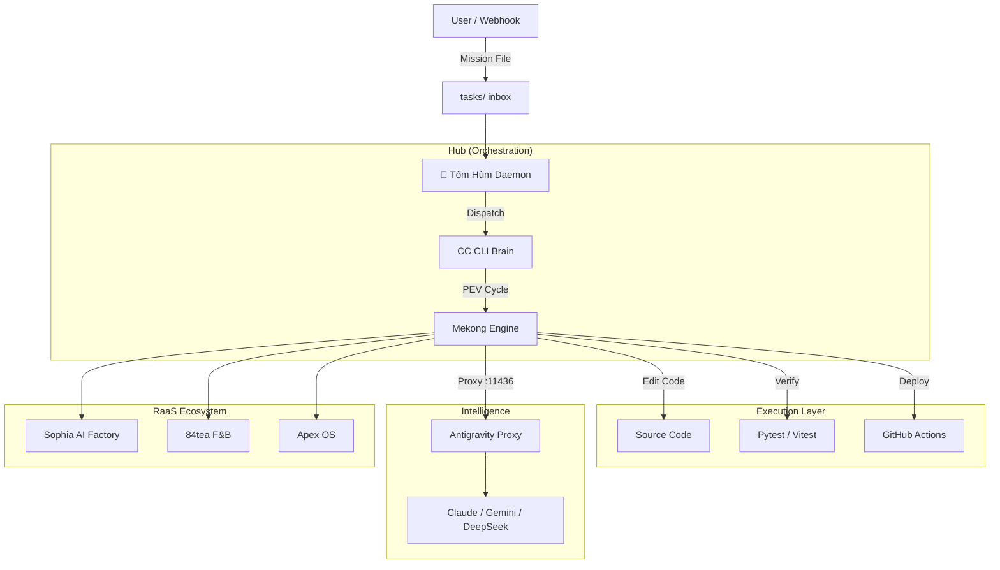

## 🌊 Mekong CLI — Hệ Điều Hành RaaS Agency

<div align="center">


**Nền tảng Revenue-as-a-Service (RaaS) cho các AI Agency tự trị.**
*Biến mô hình dịch vụ thành cỗ máy thực thi chính xác cao.*

[🚀 Bắt Đầu Nhanh](#-bắt-đầu-nhanh) • [📦 Kiến Trúc](#-kiến-trúc) • [💎 RaaS Foundation](#-raas-foundation) • [🎯 Tính Năng](#-tính-năng) • [🤝 Đóng Góp](./CONTRIBUTING.md) • [🌐 English](README.md)

</div>

---

## 📖 Giới Thiệu

**Mekong CLI** là hệ thần kinh trung ương cho các **RaaS Agency**. Lấy cảm hứng từ **Binh Pháp Tôn Tử**, hệ thống điều phối các AI agent chuyên biệt để lập kế hoạch, thực thi và kiểm tra các nhiệm vụ kỹ thuật phức tạp với độ chính xác 100%.

Nó xóa bỏ ranh giới giữa mục tiêu chiến lược và thực thi mã nguồn, đảm bảo mọi "nhiệm vụ" (mission) đều hoàn thành qua các cổng kiểm soát chất lượng nghiêm ngặt.

## 🎯 Tính Năng Nổi Bật

### 🧠 Engine Thực Thi Tự Trị (PEV)
Quy trình **Plan-Execute-Verify** (Mưu - Thực - Chứng) đảm bảo xử lý nhiệm vụ hệ thống:
- **Plan**: Phân rã nhiệm vụ sâu bằng các mô hình suy luận (Opus 4.5, Gemini 2.0).
- **Execute**: Thực thi đa nền tảng (Shell, API, LLM) với khả năng tự sửa lỗi (self-healing).
- **Verify**: Cổng chất lượng **Binh Pháp** nghiêm ngặt (An toàn kiểu dữ liệu, 0 tech debt, Kiểm tra bảo mật).

### 🦞 Tôm Hùm (OpenClaw Daemon)
Điều phối viên tự trị hoạt động 24/7:
- **Autonomous Dispatch**: Giám sát thư mục `tasks/` và điều phối nhiệm vụ đến các nút biên (edge nodes) chuyên biệt.
- **Auto-CTO**: Chủ động dọn dẹp code, fix type, và kiểm tra bảo mật khi hệ thống rảnh rỗi.
- **Hardware Awareness**: Tích hợp bảo vệ nhiệt M1 và tối ưu RAM cho các triển khai mật độ cao tại biên.

### ⚡ Antigravity Proxy
Cổng LLM tập trung (`port 11436`) tối ưu chi phí và trí tuệ:
- **Cân bằng tải**: Phân bổ yêu cầu qua Ollama, OpenRouter và các nhà cung cấp trực tiếp.
- **Dự phòng (Failover)**: Tự động chuyển đổi model (ví dụ: Sonnet sang Gemini) khi hết hạn ngạch.
- **Tối ưu hóa**: Định tuyến thông minh dựa trên độ phức tạp nhiệm vụ và ngân sách.

---

## 📦 Kiến Trúc



---

## 💎 RaaS Foundation

Mekong CLI là bản mẫu thực thi của mô hình **Revenue-as-a-Service (RaaS)**, nơi giá trị được phân phối dựa trên các nhiệm vụ tự trị.

### Mô Hình Trí Tuệ Phân Tầng
| Cấp độ | Triển khai | Trí tuệ | Phù hợp cho |
|------|------------|--------------|----------|
| **Cộng đồng (Free)** | Local Edge | Ollama / Mô hình nội bộ | Nhà phát triển & OSS |
| **Agency (Paid)** | Nút được quản lý | Antigravity Proxy (Managed) | AI Agency & Startup |
| **Doanh nghiệp** | Swarm chuyên biệt | Fine-tuned / Kho kiến thức riêng | Tập đoàn lớn |

Chi tiết về các cấp độ có thể tìm thấy tại [Tài liệu RaaS Foundation](./docs/raas-foundation.md).

---

## 🚀 Bắt Đầu Nhanh

### 1. Điều kiện tiên quyết
- **Python**: 3.11+
- **Node.js**: 20+
- **pnpm**: 8+

### 2. Cài đặt
```bash
git clone https://github.com/longtho638-jpg/mekong-cli.git
cd mekong-cli
pnpm install
pip install -r requirements.txt
cp .env.example .env
```

### 3. Khởi động General (Tôm Hùm)
```bash
cd apps/openclaw-worker
npm run start
```

### 4. Triển khai Nhiệm vụ đầu tiên
Tạo file `tasks/mission_hello.txt`:
```text
- Project: mekong-cli
- Description: Chào hỏi và kiểm tra sức khỏe hệ thống
- Instructions:
  1. In dòng chữ "Mekong CLI Sẵn Sàng"
  2. Chạy unit tests để xác nhận cài đặt
```

---

## 🤝 Đóng Góp

Chúng tôi tuân thủ các tiêu chuẩn **Binh Pháp**.
1. Đọc [Tiêu Chuẩn Code](./docs/code-standards.md).
2. Sử dụng lệnh `/cook` cho các triển khai.
3. Đảm bảo **GREEN PRODUCTION** (Điều 49) trước khi báo cáo thành công.

---

<div align="center">
**Mekong CLI** © 2026 Binh Phap Venture Studio.
*"Binh quý thần tốc."*
</div>
