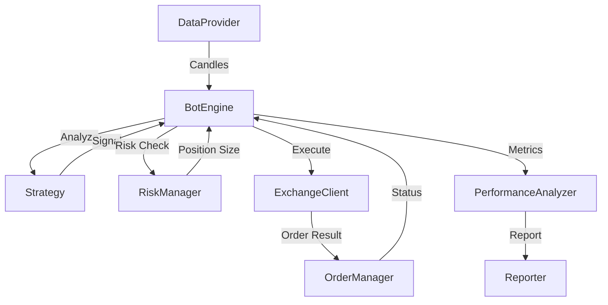

# System Architecture - Algo Trader

## High-Level Architecture
Hệ thống tuân theo mô hình **Event-Driven** và **Modular Architecture**.

## Core Components

### 1. BotEngine (`src/core/BotEngine.ts`)
Trung tâm điều phối của hệ thống. Nhận dữ liệu từ `DataProvider`, gửi đến `Strategy` để lấy tín hiệu, sau đó phối hợp với `RiskManager` và `OrderManager` để thực thi lệnh.

### 2. Strategy Layer (`src/strategies/`)
Chứa các lớp triển khai logic giao dịch.
- **Technical Indicators**: RSI Crossover, SMA.
- **Arbitrage**: Cross-Exchange, Triangular, Statistical.

### 3. Data Layer (`src/data/`)
Định nghĩa cách thức lấy dữ liệu.
- `MockDataProvider`: Dùng cho testing và backtest.
- `ExchangeDataProvider` (TBD): Dùng cho live trading qua CCXT.

### 4. Execution Layer (`src/execution/`)
Tương tác trực tiếp với API của các sàn giao dịch thông qua thư viện CCXT.

### 5. Risk & Order Management (`src/core/`)
- `RiskManager`: Tính toán số lượng cần mua/bán để đảm bảo không vi phạm quy tắc quản lý vốn.
- `OrderManager`: Lưu trữ và cập nhật trạng thái các lệnh đang mở.

## Data Flow
1. `DataProvider` phát ra sự kiện `onCandle`.
2. `BotEngine` nhận candle và chuyển cho `Strategy`.
3. `Strategy` tính toán (indicators, arbitrage spreads) và trả về `ISignal` (BUY/SELL) hoặc `null`.
4. Nếu có tín hiệu, `BotEngine` gọi `RiskManager` để xác định volume.
5. `BotEngine` gọi `ExchangeClient` để đặt lệnh.
6. Kết quả lệnh được lưu vào `OrderManager`.

## Technology Stack
- **TypeScript**: Đảm bảo an toàn kiểu dữ liệu.
- **CCXT**: Kết nối với hơn 100 sàn giao dịch crypto.
- **TechnicalIndicators**: Thư viện toán học cho phân tích kỹ thuật.
- **Winston**: Ghi log hệ thống.

Co-Authored-By: Claude Opus 4.6 <noreply@anthropic.com>
