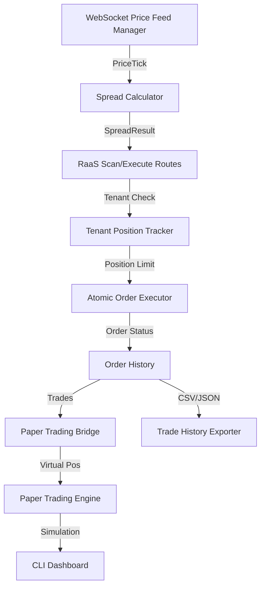

# System Architecture - Algo Trader

## High-Level Architecture
Hệ thống tuân theo mô hình **Event-Driven** và **Modular Architecture** với 3 tầng chính:
- **Execution Layer**: WebSocket price feeds, fee-aware spread calculation, atomic order execution
- **RaaS API Layer**: Multi-tenant positions, scan/execute endpoints, position tracking
- **Client Layer**: Paper trading, CLI dashboard, trade history export



## Core Components

### Phase 1: Core Strategy Engine
- **BotEngine** (`src/core/BotEngine.ts`): Điều phối chiến thuật, quản lý tín hiệu.
- **Strategy Layer** (`src/strategies/`): RSI, SMA, Cross-Exchange, Triangular, Statistical Arbitrage.
- **RiskManager** (`src/core/`): Tính toán khối lượng lệnh, kiểm soát rủi ro.
- **OrderManager** (`src/core/`): Theo dõi trạng thái lệnh.

### Phase 2: AGI RaaS Arbitrage Core
**Execution Layer** (`src/execution/`):
- **WebSocket Multi-Exchange Price Feed Manager** — Kết nối Binance/OKX/Bybit WebSocket, auto-reconnect, phát sự kiện tick real-time.
- **Fee-Aware Cross-Exchange Spread Calculator** — Tính spread ròng = gross spread - maker/taker fees - slippage, cache phí 5min TTL.
- **Atomic Cross-Exchange Order Executor** — Thực thi buy/sell song song (Promise.allSettled), rollback nếu thất bại một phần.

**Multi-Tenant Core** (`src/core/`):
- **TenantArbPositionTracker** — Theo dõi vị thế per-tenant, kiểm soát giới hạn theo tier (Basic/Pro/Enterprise).
- **Paper Trading Engine** — Mô phỏng trading không tiền thật, tính P&L, tracking positions ảo.
- **WebSocket Server** — Phát stream real-time `spread` channel cho clients.

**RaaS API Layer** (`src/api/routes/`):
- **POST /api/v1/arb/scan** — Dry-run scan spread, trả về opportunities.
- **POST /api/v1/arb/execute** — Thực thi trade (Pro/Enterprise only).
- **GET /api/v1/arb/positions** — Lấy vị thế hiện tại.
- **GET /api/v1/arb/history** — Lịch sử trade.
- **GET /api/v1/arb/stats** — Thống kê roi, win rate.

**CLI & Reporting** (`src/ui/`, `src/reporting/`):
- **CLI Dashboard** — Terminal dashboard real-time với chalk, hiển thị spreads, positions, P&L.
- **Trade History Exporter** — Export CSV/JSON cho phân tích.

## Data Flow: AGI RaaS Arbitrage Pipeline

```
1. PRICE FEED INGESTION
   WebSocket Price Feed Manager (Binance/OKX/Bybit)
   → Emits PriceTick { exchange, symbol, bid, ask, timestamp }

2. SPREAD CALCULATION
   Fee-Aware Spread Calculator
   → Input: PriceTick from 2+ exchanges
   → Output: SpreadResult { buyExchange, sellExchange, netSpreadPct, profitable }
   → Dynamic fee lookup (5min cache) + slippage estimation

3. OPPORTUNITY DETECTION
   Option A: API scan endpoint (POST /arb/scan)
            → returns all profitable spreads
   Option B: BullMQ scheduled worker detects opportunities
            → auto-routes to executor if meets criteria

4. MULTI-TENANT POSITION CHECK
   TenantArbPositionTracker
   → Check tier limits (max_positions, max_per_symbol)
   → Verify available balance

5. ATOMIC EXECUTION
   Atomic Cross-Exchange Order Executor
   → Promise.allSettled([buy_order, sell_order])
   → Partial failure → immediate rollback
   → Record order state → OrderManager

6. REAL-TIME UPDATES
   WebSocket Server broadcasts:
   - spread channel: { opportunity, netProfitUsd, timestamp }
   - position channel: { tenantId, symbol, entryPrice, currentPrice, pnl }

7. REPORTING & EXPORT
   → CLI Dashboard: real-time metrics display
   → Trade History Exporter: CSV/JSON dumps

## Technology Stack
- **TypeScript**: Type-safe contracts, strict mode enforced.
- **Fastify**: RaaS API gateway, WebSocket support.
- **WebSocket (ws library)**: Real-time price feed & position streaming.
- **CCXT**: Multi-exchange API abstraction, fee lookup.
- **TechnicalIndicators**: Math library cho chiến thuật.
- **Winston**: Structured logging.
- **BullMQ**: Job scheduling cho periodic scans.
- **Zod**: Request/response validation schemas.

## Phase 2-4 Quality Status
✅ WebSocket price feed manager (Binance/OKX/Bybit, auto-reconnect)
✅ Fee-aware spread calculator (dynamic TTL cache, slippage estimation)
✅ Atomic order executor (Promise.allSettled, rollback on failure)
✅ Multi-tenant position tracker (tier-based limits)
✅ RaaS API scan/execute/positions/history endpoints
✅ Paper trading bridge & engine
✅ CLI dashboard (real-time metrics)
✅ Trade history exporter (CSV/JSON)

## Quality Gates (Phase 4 — 100% Pass)
✅ **774/774 tests passing** (100% success rate)
✅ **0 TypeScript errors** (strict mode)
✅ **0 `any` types** (full type coverage)
✅ **0 console.log** (production clean)
✅ **0 TODO/FIXME** (zero tech debt)
✅ **Binh Phap 6 fronts:** All passed (Tech Debt, Type Safety, Performance, Security, UX, Documentation)

Updated: 2026-03-02
