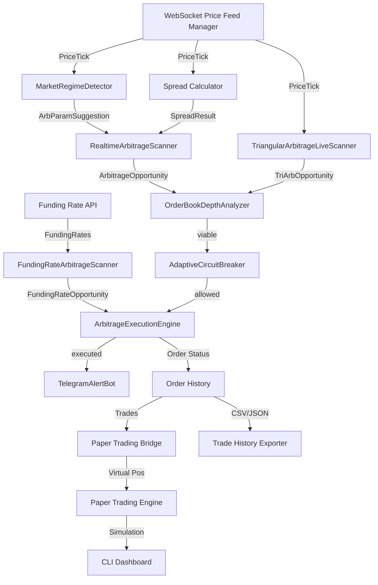

# System Architecture - Algo Trader

## High-Level Architecture
Event-Driven + Modular Architecture with 4 tiers:
- **Execution Layer**: WS price feeds, fee-aware spread calc, atomic order execution, regime detection, order-book depth analysis
- **RaaS API Layer**: Multi-tenant positions, scan/execute endpoints, position tracking
- **Client Layer**: Paper trading, CLI dashboard, trade history export
- **AGI Intelligence Layer**: Market regime detection, triangular arb, funding-rate arb, unified orchestrator



## Core Components

### Phase 1: Core Strategy Engine
- **BotEngine** (`src/core/BotEngine.ts`): Signal routing, strategy orchestration.
- **Strategy Layer** (`src/strategies/`): RSI, SMA, Cross-Exchange, Triangular, Statistical, AGI Arbitrage.
- **RiskManager** (`src/core/`): Position sizing, risk calculation.
- **OrderManager** (`src/core/`): Order state tracking.

### Phase 2: AGI RaaS Arbitrage Core (Execution Foundation)
**Execution Layer** (`src/execution/`):
- **WebSocketMultiExchangePriceFeedManager** — Binance/OKX/Bybit WS, auto-reconnect, real-time tick events.
- **FeeAwareCrossExchangeSpreadCalculator** — Net spread = gross spread - maker/taker fees - slippage, 5min TTL cache.
- **AtomicCrossExchangeOrderExecutor** — Promise.allSettled buy/sell parallel, rollback on partial failure.

**Multi-Tenant Core** (`src/core/`):
- **TenantArbPositionTracker** — Per-tenant positions, tier limits (Basic/Pro/Enterprise).
- **PaperTradingEngine** — Virtual trading simulation, P&L tracking.
- **WebSocketServer** — Real-time `spread` + `position` channel broadcast.

**RaaS API** (`src/api/routes/`):
- `POST /api/v1/arb/scan` — Dry-run spread scan.
- `POST /api/v1/arb/execute` — Execute trade (Pro/Enterprise).
- `GET /api/v1/arb/positions` — Current positions.
- `GET /api/v1/arb/history` — Trade history.
- `GET /api/v1/arb/stats` — ROI, win rate stats.

### Phase 5: RaaS Dashboard (React SPA)
**Dashboard** (`dashboard/`):
- React 19 + TypeScript 5.9 + Tailwind CSS 3.4, dark trading terminal theme.
- Vite 6, Zustand 5 state, lightweight-charts (TradingView).

**Pages**: DashboardPage, BacktestsPage, MarketplacePage, SettingsPage, ReportingPage.

**Components**: SidebarNavigation, PriceTickerStrip, PositionsTableSortable, SpreadOpportunitiesCardGrid.

**Hooks**: `useWebSocketPriceFeed` (25ms buffered Zustand updates), `useApiClient` (typed fetch).

### Phase 9: AGI Arbitrage Core (Live Execution)
**New Execution Modules** (`src/execution/`):
- **RealtimeArbitrageScanner** — EventEmitter; maintains latest bid/ask per exchange:symbol, emits `opportunity` on profitable spreads (configurable `minNetSpreadPct`, `scanIntervalMs`, stale-tick guard).
- **ArbitrageExecutionEngine** — Wires Scanner → CircuitBreaker → AtomicExecutor → position tracking → Telegram alerts. Cooldown per pair, max concurrent executions, cumulative metrics (`ArbEngineMetrics`).
- **ArbLiveOrchestrator** (`src/cli/arb-live-cross-exchange-command.ts`) — Composes PriceFeedManager + RealtimeArbitrageScanner + ArbitrageExecutionEngine into a single live session; exposed via `arb:live` CLI.

**CLI**: `arb:live` — Live cross-exchange arb session with configurable symbols/exchanges.

### Phase 10: Order Book Depth Analyzer
**New Module** (`src/execution/order-book-depth-analyzer.ts`):
- **OrderBookDepthAnalyzer** — Fetches real L2 order book from each exchange via CCXT, calculates actual slippage for target position size, computes available liquidity depth, and returns `SpreadDepthAnalysis` (viable flag, real slippage pct, worst fill price).
- Interfaces: `DepthAnalysis`, `SpreadDepthAnalysis`, `DepthAnalyzerConfig`.
- Wired into ArbitrageExecutionEngine pre-execution check — opportunity discarded if liquidity insufficient.

### Phase 11: AGI Intelligence Suite
**New Modules** (`src/execution/`):
- **MarketRegimeDetector** — EventEmitter; classifies market into regimes (trending/ranging/volatile/calm) from rolling volatility, trend strength, spread dispersion. Emits `regime-change` + `params-suggestion` (`ArbParamSuggestion`) → scanner adapts thresholds dynamically.
- **TriangularArbitrageLiveScanner** — EventEmitter; detects 3-leg intra-exchange cycles (A→B→C→A). Evaluates all `TriArbCycle` combos per tick, filters by net profit after fees, emits `opportunity` (`TriArbOpportunity`).
- **FundingRateArbitrageScanner** — EventEmitter; polls funding rate API across exchanges at configurable interval, computes net spread (rate diff - fees), emits `opportunity` (`FundingRateOpportunity`). Tracks `FundingRateStats`.

### Phase 12: Unified AGI Arb Command
**CLI** (`src/cli/arb-agi-auto-execution-commands.ts`):
- `arb:agi` — Unified command; launches all strategies in parallel: RealtimeArbitrageScanner, TriangularArbitrageLiveScanner, FundingRateArbitrageScanner, with MarketRegimeDetector providing adaptive params. Routes all opportunities through OrderBookDepthAnalyzer → CircuitBreaker → ArbitrageExecutionEngine.
- `arb:auto` — Autonomous mode with auto-restart on error.

### Phase 7: Live Exchange Manager (Production Live Trading)
**Core Orchestrator** (`src/execution/live-exchange-manager.ts`):
- **LiveExchangeManager** — Unified lifecycle orchestrator: composes ExchangeConnectionPool + WebSocketMultiExchangePriceFeedManager + ExchangeRouterWithFallback + ExchangeHealthMonitor.
- Auto-recovery on connection loss, graceful shutdown, startup health gating.
- Methods: `start()`, `stop()`, `getRouter()`, `getHealthSnapshot()`.

**Supporting Components** (`src/execution/`):
- **ExchangeRegistry** (`exchange-registry.ts`) — Central config store: exchange credentials, pairs, rate limits.
- **ExchangeHealthMonitor** (`exchange-health-monitor.ts`) — Per-exchange health tracking (connected/degraded/disconnected), rolling latency P50/P95, error rate, event bus.
- **ExchangeConnectionPool** (`exchange-connection-pool.ts`) — CCXT instance pooling, connection lifecycle management.
- **ExchangeRouterWithFallback** (`exchange-router-with-fallback.ts`) — Route orders with automatic fallback to healthy exchange.

### Phase 15-17: Stealth Execution Layer
**Anti-Detection** (`src/execution/`):
- **AntiDetectionSafetyLayer** (`anti-detection-order-randomizer-safety-layer.ts`) — Order timing jitter ±30%, size jitter ±5%, rate governor (calls/min, orders/hour), exchange 429/418 auto-pause, 403/451 kill switch, balance checkpoint auto-stop.
- **BinhPhapStealthStrategy** (`binh-phap-stealth-trading-strategy.ts`) — 孫子兵法 13-chapter anti-detection: 始計 pre-assessment, 虛實 order splitting (2-5 chunks), 兵勢 volume-aware timing, 九變 5-level threat system, 地形 exchange profiles, 火攻 confidence gate.
- **PhantomOrderCloakingEngine** (`phantom-order-cloaking-engine.ts`) — 3-layer cloaking: order splitting, randomized timing, size camouflage to mask bot patterns.
- **stealth-cli-fingerprint-masking-middleware.ts** — Browser-like HTTP headers on all CCXT requests to avoid bot detection.
- **stealth-execution-algorithms.ts** — Shared stealth math: jitter distributions, normalization.

**Telegram Integration**:
- Stealth commands: `/safety` (status), `/kill` (emergency stop), `/kill_reset`, `/binh_phap` (stealth report).
- **TelegramCommandHandler** (`telegram-command-handler.ts`) — Long-polling receiver, chat ID security, commands: /status, /backtest, /balance, /health, /arb, /arb_live, /stop, /help, /safety, /kill.

### CLI Onboarding (Zero-Config)
**Setup Wizard** (`src/cli/setup-wizard-command.ts`):
- Interactive readline wizard — prompts exchange API keys, auto-generates `.env` with smart defaults.
- Validates key format (min length), supports Binance/OKX/Bybit, optional Telegram alerts.

**Quickstart** (`src/cli/quickstart-zero-config-command.ts`):
- One command: detects `.env` → runs setup if missing → demo backtest → shows available commands.
- Backtest/dry-run works without Docker (no DB/Redis required).

**Shell Script** (`scripts/one-click-setup-and-start.sh`):
- Prerequisites check → npm/pnpm install → CLI wizard → optional Docker infra.

### Infrastructure
**Database** (`prisma/`):
- PostgreSQL 16 via Prisma ORM — 9 models (Tenant, ApiKey, Strategy, Order, Trade, BacktestResult, Candle, PnlSnapshot, AlertRule).
- Row-level isolation via tenantId FK on all business tables.

**Job Queue** (`src/jobs/`):
- BullMQ + Redis 7 — 4 queues: backtest, scan, webhook, optimization.
- Workers: backtest runner, scan detector, signed webhook delivery, grid search optimizer.

**Billing** (`src/billing/`):
- Polar.sh — 3 tiers (FREE $0, PRO $49, ENTERPRISE custom), HMAC-SHA256 webhook verification.

**Monitoring** (`docker-compose.yml`):
- Prometheus (:9090) + Grafana (:3001).

## Data Flow: Full AGI Arbitrage Pipeline

```
WS Ticks → MarketRegimeDetector → regime-change → ArbParamSuggestion
         → RealtimeArbitrageScanner (cross-exchange) → ArbitrageOpportunity
         → TriangularArbitrageLiveScanner (intra-exchange) → TriArbOpportunity
Funding API → FundingRateArbitrageScanner → FundingRateOpportunity

All Opportunities →
  OrderBookDepthAnalyzer → viable? (real slippage vs threshold)
  → AdaptiveCircuitBreaker → allowed? (exchange health, trip count)
  → ArbitrageExecutionEngine → Promise.allSettled atomic orders
  → TelegramAlertBot → trade notification
  → OrderHistory → PnlSnapshot → CSV/JSON export
```

## Technology Stack
| Layer | Tech |
|-------|------|
| Language | TypeScript 5.9, strict mode |
| Runtime | Node.js 20 |
| API Gateway | Fastify 5 |
| WebSocket | ws library |
| Exchange Abstraction | CCXT 4.5 |
| Job Queue | BullMQ 5 + Redis 7 (IoRedis) |
| Database | PostgreSQL 16 via Prisma |
| Validation | Zod 4.3 |
| Logging | Winston |
| Testing | Jest 29 |
| CLI | Commander |
| Dashboard | React 19, Vite 6, Zustand 5, Tailwind, TradingView Charts |

## Quality Status (All Phases)

### Completed Phases
- Phase 1: Core Strategy Engine
- Phase 2: AGI RaaS Arbitrage Core (WS feeds, spread calc, atomic executor)
- Phase 3: Multi-Tenant API & Auth
- Phase 4: BullMQ Job Queue
- Phase 5: React Dashboard + RaaS Bootstrap
- Phase 6: ML Trading (GRU, Q-Learning, Feature Engineering)
- Phase 7: Production Live Trading (LiveExchangeManager, SignalOrderPipeline, PositionManager, CircuitBreaker v2, TelegramBot, DryRun)
- Phase 8: AGI Trade Go-Live (AgiTradeOrchestrator, `agi:trade` CLI)
- Phase 9: AGI Arbitrage Core (RealtimeArbitrageScanner, ArbitrageExecutionEngine)
- Phase 10: Order Book Depth Analyzer
- Phase 11: AGI Intelligence Suite (MarketRegimeDetector, TriangularArb, FundingRateArb)
- Phase 12: Unified AGI Arb Command (`arb:agi`)
- Phase 13: Zero-Config Quickstart
- Phase 14: Telegram Phone Trading Bot
- Phase 15: Anti-Detection Safety Layer
- Phase 16: BinhPhap Stealth Strategy
- Phase 17: Phantom Order Cloaking + CLI Fingerprint Masking

### Quality Gates
- **1216 tests** (102 test suites, Jest 29, 100% pass rate)
- **232+ source files** (TypeScript 5.9, strict mode)
- **0 TypeScript errors**
- **0 `any` types** (test mocks only — acceptable)
- **0 console.log** (production clean)
- **0 TODO/FIXME** (zero tech debt)
- **Binh Phap 6/6 fronts passing**

Updated: 2026-03-03
