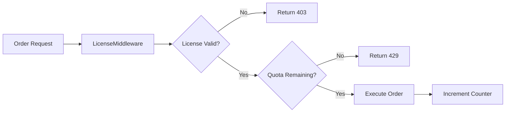

# Phase 1: Trade Execution Gating

## Overview

Gate trade execution based on license tier with daily order quotas.

## Tier Limits

| Tier | Concurrent Strategies | Orders/Day |
|------|----------------------|------------|
| FREE | 1 | 10 |
| PRO | 5 | 100 |
| ENTERPRISE | Unlimited | 1000 |

## Architecture



## Implementation Steps

### 1.1 Create Trade Gate Middleware

**File:** `src/middleware/trade-gate-middleware.ts`

```typescript
interface TradeQuota {
  dailyLimit: number;
  usedToday: number;
  resetAt: Date;
}

const TIER_LIMITS: Record<LicenseTier, TradeQuota> = {
  [LicenseTier.FREE]: { dailyLimit: 10, usedToday: 0, resetAt: tomorrow() },
  [LicenseTier.PRO]: { dailyLimit: 100, usedToday: 0, resetAt: tomorrow() },
  [LicenseTier.ENTERPRISE]: { dailyLimit: 1000, usedToday: 0, resetAt: tomorrow() },
};
```

### 1.2 Integrate with OrderManager

**File:** `src/core/OrderManager.ts`

- Add `checkTradeQuota()` call before `placeOrder()`
- Increment counter after successful order
- Return quota headers in API responses

### 1.3 Add API Endpoint for Quota Status

**File:** `src/api/routes/license-quota-routes.ts`

```typescript
GET /api/license/quota → {
  tier: 'pro',
  dailyLimit: 100,
  usedToday: 45,
  remaining: 55,
  resetsAt: '2026-03-09T00:00:00Z'
}
```

## Files to Modify/Create

| Action | File |
|--------|------|
| Create | `src/middleware/trade-gate-middleware.ts` |
| Modify | `src/core/OrderManager.ts` |
| Create | `src/api/routes/license-quota-routes.ts` |
| Modify | `src/lib/raas-gate.ts` (add quota tracking) |

## Success Criteria

- [ ] Orders blocked when daily quota exceeded
- [ ] Quota resets at midnight UTC
- [ ] API returns X-RateLimit-Remaining header
- [ ] Quota status endpoint works

## Risk Assessment

- **Risk:** Counter reset timezone confusion
- **Mitigation:** Document UTC reset clearly, show countdown in UI
