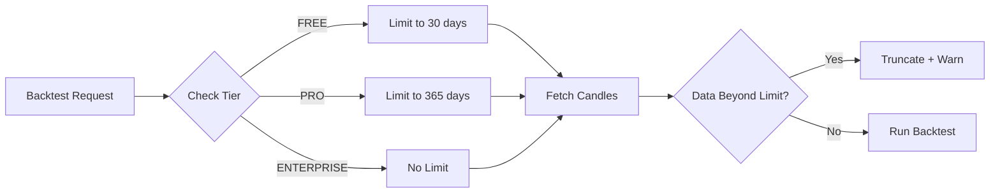

# Phase 2: Backtest Depth Limits

## Overview

Restrict historical data access based on license tier to control data costs and gate premium features.

## Tier Limits

| Tier | Historical Data | Max Candles |
|------|-----------------|-------------|
| FREE | 1 month | ~43,200 (1h candles) |
| PRO | 1 year | ~525,600 (1h candles) |
| ENTERPRISE | Unlimited | No limit |

## Architecture



## Implementation Steps

### 2.1 Add Backtest Limit Config

**File:** `src/lib/raas-gate.ts`

```typescript
const BACKTEST_LIMITS: Record<LicenseTier, { days: number; maxCandles?: number }> = {
  [LicenseTier.FREE]: { days: 30 },
  [LicenseTier.PRO]: { days: 365 },
  [LicenseTier.ENTERPRISE]: { days: 99999 },
};
```

### 2.2 Modify BacktestEngine

**File:** `src/backtest/BacktestEngine.ts`

```typescript
async runBacktest(strategy, options) {
  const tier = LicenseService.getInstance().getTier();
  const limit = BACKTEST_LIMITS[tier];

  const startDate = new Date();
  startDate.setDate(startDate.getDate() - limit.days);

  const candles = await dataProvider.getCandles(
    options.pair,
    options.timeframe,
    startDate,
    new Date()
  );

  if (candles.length > limit.maxCandles && limit.maxCandles) {
    logger.warn(`Backtest truncated to ${limit.maxCandles} candles (tier: ${tier})`);
    candles.splice(limit.maxCandles);
  }

  return this.execute(strategy, candles);
}
```

### 2.3 Add Warning Response

Include warning in backtest response:

```json
{
  "success": true,
  "data": { ... },
  "warnings": ["Historical data limited to 30 days (FREE tier). Upgrade to PRO for 1 year."]
}
```

## Files to Modify/Create

| Action | File |
|--------|------|
| Modify | `src/lib/raas-gate.ts` (add BACKTEST_LIMITS) |
| Modify | `src/backtest/BacktestEngine.ts` |
| Modify | `src/backtest/BacktestRunner.ts` |

## Success Criteria

- [ ] FREE tier limited to 30 days of data
- [ ] PRO tier limited to 365 days
- [ ] ENTERPRISE has no limits
- [ ] Warning included in truncated responses
- [ ] Backtest fails gracefully with clear error

## Unresolved Questions

1. Should we allow FREE users to backtest with shorter timeframes (e.g., 5m candles)?
2. Should we charge overage for exceeding candle limits?
