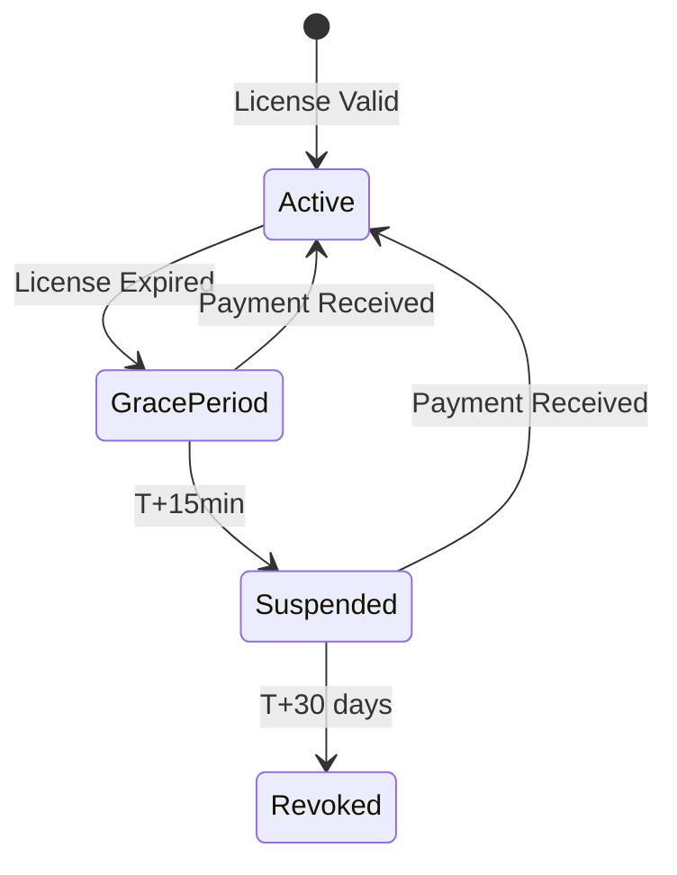

# Phase 3: Grace Period Handling

## Overview

When license expires, start a 15-minute grace period with progressive notifications before blocking trading.

## Grace Period Timeline

```
T+0     ──> License expires, grace period starts
          ──> Send notification #1 (Warning)
T+5     ──> Send notification #2 (5 min remaining)
T+10    ──> Send notification #3 (5 min left)
T+15    ──> Grace period ends
          ──> Send notification #4 (Final)
          ──> Block all trading
```

## Tier Grace Periods

| Tier | Grace Period |
|------|--------------|
| FREE | None |
| PRO | 15 minutes |
| ENTERPRISE | 30 minutes |

## Architecture



## Implementation Steps

### 3.1 Add Grace Period State to LicenseService

**File:** `src/lib/raas-gate.ts`

```typescript
interface GracePeriodState {
  startedAt: Date;
  expiresAt: Date;
  notificationsSent: number;
}

class LicenseService {
  private gracePeriod: GracePeriodState | null = null;

  startGracePeriod(): void {
    const tier = this.getTier();
    const durationMinutes = tier === LicenseTier.ENTERPRISE ? 30 : 15;

    this.gracePeriod = {
      startedAt: new Date(),
      expiresAt: new Date(Date.now() + durationMinutes * 60 * 1000),
      notificationsSent: 0,
    };
  }

  isInGracePeriod(): boolean {
    if (!this.gracePeriod) return false;
    return new Date() < this.gracePeriod.expiresAt;
  }

  getGracePeriodRemaining(): number | null {
    if (!this.gracePeriod) return null;
    return Math.max(0, this.gracePeriod.expiresAt.getTime() - Date.now());
  }
}
```

### 3.2 Create Grace Period Scheduler

**File:** `src/jobs/grace-period-scheduler.ts`

```typescript
/**
 * Check grace period status every minute
 * Send notifications at T+0, T+5, T+10, T+15
 */
export class GracePeriodScheduler {
  private interval: NodeJS.Timeout | null = null;

  start(): void {
    this.interval = setInterval(async () => {
      const service = LicenseService.getInstance();

      if (service.isInGracePeriod()) {
        const remaining = service.getGracePeriodRemaining()!;
        const minutesRemaining = Math.ceil(remaining / 60000);

        // Send notifications at milestones
        if ([15, 10, 5, 0].includes(minutesRemaining)) {
          await this.sendGracePeriodNotification(minutesRemaining);
        }

        // End grace period
        if (remaining <= 0) {
          await service.suspendLicense();
        }
      }
    }, 60000); // Check every minute
  }

  private async sendGracePeriodNotification(minutesRemaining: number): Promise<void> {
    const service = LicenseService.getInstance();
    const tenantId = await this.getTenantId();

    let eventType: BillingEventType;
    let message: string;

    switch (minutesRemaining) {
      case 15:
        eventType = 'grace_period_started';
        message = 'Grace period started. 15 minutes remaining.';
        break;
      case 10:
        eventType = 'grace_period_started';
        message = '10 minutes remaining to renew license.';
        break;
      case 5:
        eventType = 'account_suspended';
        message = 'WARNING: 5 minutes remaining. Immediate action required!';
        break;
      case 0:
        eventType = 'account_suspended';
        message = 'Account suspended. Trading blocked.';
        break;
    }

    await billingNotificationService.sendNotification(
      eventType,
      tenantId,
      ['email', 'telegram'],
      {
        gracePeriodDays: 0,
        gracePeriodEndsAt: new Date(Date.now() + minutesRemaining * 60000),
      }
    );
  }
}
```

### 3.3 Integrate with Trading Engine

**File:** `src/core/BotEngine.ts`

```typescript
async executeTrade(signal): Promise<void> {
  const license = LicenseService.getInstance();

  // Block if expired and not in grace period
  if (license.isExpired() && !license.isInGracePeriod()) {
    throw new LicenseError(
      'Trading blocked: License expired',
      LicenseTier.PRO,
      'trading'
    );
  }

  // Allow if in grace period
  if (license.isInGracePeriod()) {
    logger.warn(`Trading in grace period. ${license.getGracePeriodRemaining()!}ms remaining`);
  }

  // ... proceed with trade
}
```

## Files to Modify/Create

| Action | File |
|--------|------|
| Modify | `src/lib/raas-gate.ts` (add grace period state) |
| Create | `src/jobs/grace-period-scheduler.ts` |
| Modify | `src/core/BotEngine.ts` |
| Modify | `src/notifications/billing-notification-service.ts` |

## Success Criteria

- [ ] Grace period starts automatically on license expiry
- [ ] Notifications sent at T+0, T+5, T+10, T+15
- [ ] Trading blocked after grace period ends
- [ ] Grace period duration configurable by tier
- [ ] Dashboard shows countdown timer

## Unresolved Questions

1. Should grace period notifications be configurable (SMS, webhook)?
2. Should we allow custom grace period duration per tenant?
