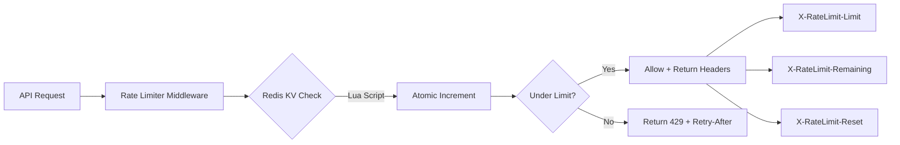

# Phase 4: KV Rate Limiting Integration

## Overview

Use Redis with Lua scripts for atomic, distributed rate limiting across multiple instances.

## Rate Limit Config

| Tier | Requests/Min | Requests/Hour | Burst Limit |
|------|--------------|---------------|-------------|
| FREE | 10 | 100 | 2 |
| PRO | 100 | 1000 | 10 |
| ENTERPRISE | 1000 | 10000 | 50 |

## Architecture



## Implementation Steps

### 4.1 Create Redis Sliding Window Rate Limiter

**File:** `src/lib/redis-rate-limiter.ts`

```typescript
import { Redis } from 'ioredis';

const LUA_SCRIPT = `
local key = KEYS[1]
local limit = tonumber(ARGV[1])
local windowMs = tonumber(ARGV[2])
local now = tonumber(ARGV[3])

-- Remove old entries
redis.call('ZREMRANGEBYSCORE', key, 0, now - windowMs)

-- Count current requests
local count = redis.call('ZCARD', key)

if count >= limit then
  return {0, count}
end

-- Add new request
redis.call('ZADD', key, now, now .. ':' .. math.random(1, 1000000))
redis.call('EXPIRE', key, math.ceil(windowMs / 1000))

return {1, count + 1}
`;

export class RedisRateLimiter {
  private redis: Redis;

  constructor(redisUrl: string) {
    this.redis = new Redis(redisUrl);
  }

  async checkLimit(
    key: string,
    limit: number,
    windowMs: number
  ): Promise<{ allowed: boolean; count: number; remaining: number }> {
    const now = Date.now();
    const result = await this.redis.eval(
      LUA_SCRIPT,
      1,
      key,
      limit.toString(),
      windowMs.toString(),
      now.toString()
    );

    const [allowed, count] = result as [number, number];

    return {
      allowed: allowed === 1,
      count,
      remaining: Math.max(0, limit - count),
    };
  }

  async getUsage(key: string, windowMs: number): Promise<number> {
    const now = Date.now();
    await this.redis.zremrangebyscore(key, 0, now - windowMs);
    return this.redis.zcard(key);
  }
}
```

### 4.2 Integrate with Existing Rate Limiter

**File:** `src/lib/rate-limiter.ts`

```typescript
// Add Redis-backed implementation
export async function checkRateLimitRedis(
  key: string,
  tier?: LicenseTier
): Promise<{ allowed: boolean; headers: Record<string, string> }> {
  const config = getRateLimitConfig(tier);
  const redisLimiter = new RedisRateLimiter(process.env.REDIS_URL!);

  const minuteKey = `ratelimit:${key}:minute`;
  const hourKey = `ratelimit:${key}:hour`;

  const minuteResult = await redisLimiter.checkLimit(
    minuteKey,
    config.requestsPerMinute,
    60 * 1000
  );

  const hourResult = await redisLimiter.checkLimit(
    hourKey,
    config.requestsPerHour,
    60 * 60 * 1000
  );

  const allowed = minuteResult.allowed && hourResult.allowed;

  return {
    allowed,
    headers: {
      'X-RateLimit-Limit': config.requestsPerMinute.toString(),
      'X-RateLimit-Remaining': minuteResult.remaining.toString(),
      'X-RateLimit-Hour-Limit': config.requestsPerHour.toString(),
      'X-RateLimit-Hour-Remaining': hourResult.remaining.toString(),
      'X-RateLimit-Reset': Math.ceil((Date.now() + 60000) / 1000).toString(),
      ...(allowed ? {} : { 'Retry-After': '60' }),
    },
  };
}
```

### 4.3 Add Rate Limit Middleware

**File:** `src/middleware/rate-limit-middleware.ts`

```typescript
export async function rateLimitMiddleware(
  c: Context,
  next: Next
): Promise<void> {
  const key = c.get('licenseKey') || c.get('ip');
  const tier = c.get('licenseTier');

  const { allowed, headers } = await checkRateLimitRedis(key, tier);

  // Add headers to response
  for (const [key, value] of Object.entries(headers)) {
    c.header(key, value);
  }

  if (!allowed) {
    return c.json(
      {
        error: 'Rate Limit Exceeded',
        message: 'Too many requests. Please slow down.',
        retryAfter: headers['Retry-After'],
      },
      429
    );
  }

  await next();
}
```

## Files to Modify/Create

| Action | File |
|--------|------|
| Create | `src/lib/redis-rate-limiter.ts` |
| Modify | `src/lib/rate-limiter.ts` |
| Create | `src/middleware/rate-limit-middleware.ts` |
| Modify | `src/api/index.ts` (add middleware) |

## Success Criteria

- [ ] Atomic rate limiting with Redis + Lua
- [ ] X-RateLimit-* headers on all responses
- [ ] 429 response with Retry-After header
- [ ] Distributed rate limiting across instances
- [ ] Sliding window accuracy verified in tests

## Unresolved Questions

1. Should we use fixed window instead for simplicity?
2. Should rate limits be configurable per tenant?
