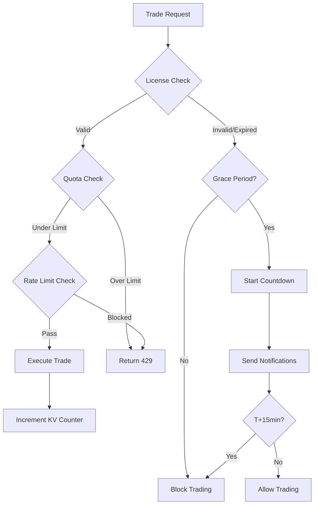

# Phase 6 License Enforcement Plan

## Overview

Comprehensive license enforcement system with real-time trade gating, usage quotas, grace period handling, and multi-channel notifications.

## Tier Limits Summary

| Feature | FREE | PRO | ENTERPRISE |
|---------|------|-----|------------|
| Concurrent Strategies | 1 | 5 | Unlimited |
| Orders/Day | 10 | 100 | 1000 |
| Backtest History | 1 month | 1 year | Unlimited |
| Rate Limit (req/min) | 10 | 100 | 1000 |
| Grace Period | None | 15 min | 30 min |

## Architecture

## Phase Files

1. [phase-01-trade-execution-gating.md](./phase-01-trade-execution-gating.md) — Trade execution gating
2. [phase-02-backtest-limits.md](./phase-02-backtest-limits.md) — Backtest depth limits
3. [phase-03-grace-period.md](./phase-03-grace-period.md) — Grace period handling
4. [phase-04-kv-rate-limiting.md](./phase-04-kv-rate-limiting.md) — KV rate limiting integration
5. [phase-05-notifications.md](./phase-05-notifications.md) — Notification system
6. [phase-06-testing.md](./phase-06-testing.md) — Unit & integration tests

## TODO Checklist

- [ ] Phase 1: Trade execution gating middleware
- [ ] Phase 2: Backtest depth limit enforcement
- [ ] Phase 3: Grace period countdown + notifications
- [ ] Phase 4: Redis KV sliding window rate limiter
- [ ] Phase 5: Multi-channel notifications (Email, Telegram, Webhook)
- [ ] Phase 6: Comprehensive test suite

## Dependencies

- Existing `LicenseService` (src/lib/raas-gate.ts)
- Existing `rate-limiter.ts` (sliding window)
- Existing `billing-notification-service.ts`
- Redis for distributed KV storage
- Polar webhook integration for subscription events

## Unresolved Questions

1. Should grace period be configurable per tenant?
2. Do we need a dashboard UI for quota monitoring?
3. Should overage charges apply for ENTERPRISE tier?
