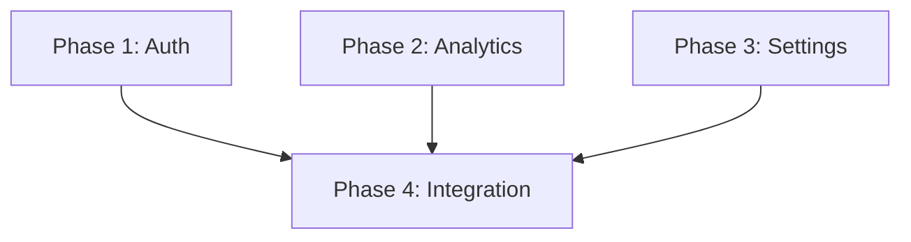

# /plan:parallel

Lệnh lập kế hoạch thực thi song song. Tạo kế hoạch triển khai với các giai đoạn có thể chạy đồng thời, sử dụng đồ thị phụ thuộc và ranh giới sở hữu file để ngăn xung đột.

## Cú pháp

```bash
/plan:parallel [task]
```

## Khi nào sử dụng

- **Module độc lập**: Tính năng không chia sẻ file
- **Thực thi đa agent**: Khi muốn thực thi agent song song
- **Tính năng lớn**: Chia công việc thành các luồng đồng thời
- **Song song hóa team**: Nhiều developer làm việc đồng thời

## Ví dụ nhanh

```bash
/plan:parallel [implement user dashboard with auth, analytics, and settings modules]
```

**Kết quả**:
```
Creating parallel execution plan...

## Dependency Graph

Phase 1: Auth Module (no deps)
Phase 2: Analytics Module (no deps)
Phase 3: Settings Module (no deps)
Phase 4: Dashboard Integration (depends on 1, 2, 3)

## Parallelization Strategy

Wave 1 (Parallel): Phase 1 + Phase 2 + Phase 3
Wave 2 (Sequential): Phase 4

## File Ownership Matrix

Phase 1: src/auth/*, src/middleware/auth.ts
Phase 2: src/analytics/*, src/hooks/useAnalytics.ts
Phase 3: src/settings/*, src/hooks/useSettings.ts
Phase 4: src/dashboard/*, src/pages/dashboard.tsx

Plan saved: plans/251129-dashboard/plan.md
Execute with: /code:parallel
```

## Tham số

- `[task]`: Mô tả tính năng đa component cần lập kế hoạch (bắt buộc)

## Khái niệm chính

### Đồ thị phụ thuộc

Hiển thị giai đoạn nào phụ thuộc vào giai đoạn khác:

```
Phase 1 (Auth) ────────┐
                       ├──→ Phase 4 (Integration)
Phase 2 (Analytics) ───┤
                       │
Phase 3 (Settings) ────┘
```

- **No deps**: Giai đoạn có thể bắt đầu ngay
- **Depends on X**: Phải chờ X hoàn thành
- **Parallel**: Nhiều giai đoạn không có phụ thuộc chung

### Ma trận sở hữu file

Gán quyền truy cập file độc quyền cho mỗi giai đoạn:

```
Phase 1: src/auth/**
Phase 2: src/analytics/**
Phase 3: src/settings/**
Phase 4: src/dashboard/**, src/app.tsx
```

**Tại sao cần sở hữu file?**
- Ngăn xung đột merge
- Cho phép thực thi song song thực sự
- Ranh giới rõ ràng cho các agent
- Không cần điều phối giữa các giai đoạn song song

### Chiến lược song song hóa

Nhóm các giai đoạn thành các wave thực thi:

```
Wave 1 (Parallel):
├── Phase 1: Auth Module
├── Phase 2: Analytics Module
└── Phase 3: Settings Module

Wave 2 (Sequential):
└── Phase 4: Dashboard Integration
```

- **Wave song song**: Tất cả giai đoạn chạy đồng thời
- **Wave tuần tự**: Chờ wave trước hoàn thành

## Cấu trúc kế hoạch

Kế hoạch được tạo bao gồm các phần:

```markdown
# Plan: [Tên tác vụ]

## Overview
Mô tả ngắn về triển khai

## Dependency Graph


## File Ownership Matrix

| Phase | Owned Files | Shared (Read-Only) |
|-------|-------------|-------------------|
| Phase 1 | src/auth/* | src/types/* |
| Phase 2 | src/analytics/* | src/types/* |
| Phase 3 | src/settings/* | src/types/* |
| Phase 4 | src/dashboard/* | All above |

## Parallelization Strategy

### Wave 1 (Parallel Execution)
- Phase 1, Phase 2, Phase 3 can run simultaneously
- No dependencies between these phases
- Estimated time: 2 hours (longest phase)

### Wave 2 (Sequential)
- Phase 4 requires all Wave 1 phases complete
- Integrates all modules
- Estimated time: 1 hour

## Phases

### Phase 1: Auth Module
[Detailed implementation steps]

### Phase 2: Analytics Module
[Detailed implementation steps]

...
```

## Ví dụ đầy đủ

### Kịch bản: Hệ thống Checkout E-commerce

```bash
/plan:parallel [build checkout system with cart, payment, shipping, and order confirmation]
```

**Kế hoạch được tạo**:

```markdown
# Plan: E-commerce Checkout System

## Overview
Multi-module checkout system with independent cart, payment,
shipping calculation, and order confirmation components.

## Dependency Graph

```
Cart ──────────────────┐
                       │
Payment Gateway ───────┼──→ Order Processing ──→ Confirmation
                       │
Shipping Calculator ───┘
```

## File Ownership Matrix

| Phase | Exclusive Files | Notes |
|-------|-----------------|-------|
| Phase 1: Cart | src/cart/*, src/hooks/useCart.ts | Cart state management |
| Phase 2: Payment | src/payment/*, src/hooks/usePayment.ts | Stripe integration |
| Phase 3: Shipping | src/shipping/*, src/hooks/useShipping.ts | Rate calculation |
| Phase 4: Orders | src/orders/*, src/hooks/useOrder.ts | Order creation |
| Phase 5: UI | src/checkout/*, src/pages/checkout.tsx | Final integration |

**Shared (Read-Only)**:
- src/types/* - Type definitions
- src/utils/* - Utility functions
- src/config/* - Configuration

## Parallelization Strategy

### Wave 1: Independent Modules (Parallel)

**Phase 1: Cart Module** [2 agents]
- Cart state management (Zustand)
- Add/remove/update items
- Cart persistence (localStorage)
- Cart summary calculations

**Phase 2: Payment Gateway** [1 agent]
- Stripe integration
- Payment intent creation
- Card validation
- Error handling

**Phase 3: Shipping Calculator** [1 agent]
- Address validation
- Rate calculation API
- Shipping method selection
- Delivery estimation

**Execution**: All three phases run simultaneously
**Duration**: ~2 hours (determined by longest phase)

### Wave 2: Order Processing (Sequential)

**Phase 4: Order Processing** [1 agent]
- Depends on: Phase 1, 2, 3
- Order creation service
- Inventory deduction
- Payment capture
- Shipping label generation

**Execution**: Starts after Wave 1 complete
**Duration**: ~1.5 hours

### Wave 3: UI Integration (Sequential)

**Phase 5: Checkout UI** [1 agent]
- Depends on: Phase 4
- Multi-step checkout flow
- Form validation
- Order review page
- Confirmation page

**Execution**: Starts after Wave 2 complete
**Duration**: ~1 hour

## Execution Command

```bash
# Execute all phases with parallel support
/code:parallel @plans/251129-checkout/plan.md
```

## Success Criteria

- [ ] Cart operations work independently
- [ ] Payment processes without cart dependency
- [ ] Shipping calculates before payment
- [ ] Order combines all modules
- [ ] No file conflicts between phases
```

## Trường hợp sử dụng

### Module tính năng độc lập

```bash
/plan:parallel [build admin panel with user management, content management, and analytics]
```

Ba module độc lập, một giai đoạn tích hợp.

### Thiết lập microservices

```bash
/plan:parallel [create microservices for auth, products, orders, and notifications]
```

Mỗi service là một giai đoạn riêng với sở hữu file riêng.

### Thư viện component

```bash
/plan:parallel [build UI component library with buttons, forms, modals, and tables]
```

Mỗi danh mục component là một giai đoạn độc lập.

### Nhóm API Endpoint

```bash
/plan:parallel [implement REST API with users, products, orders, and search endpoints]
```

Mỗi nhóm endpoint có thể được phát triển song song.

## Thực thi

Sau khi tạo kế hoạch parallel, thực thi với:

```bash
# Thực thi với hỗ trợ agent song song
/code:parallel @plans/251129-{task}/plan.md
```

Lệnh `/code:parallel`:
1. Đọc đồ thị phụ thuộc
2. Khởi chạy agent song song cho Wave 1
3. Chờ wave hoàn thành
4. Tiến hành wave tiếp theo
5. Lặp lại cho đến khi tất cả wave hoàn thành

## Thực hành tốt nhất

### Ranh giới module rõ ràng

Định nghĩa tác vụ với phân tách tự nhiên:

```bash
# Tốt: Ranh giới rõ ràng
/plan:parallel [build auth service, payment service, and notification service]

# Khó song song hóa hơn
/plan:parallel [build user profile with settings and preferences]
```

### Giảm thiểu file chia sẻ

Giữ file chia sẻ ở dạng types/utils chỉ đọc:

```
✅ Cấu trúc tốt:
src/auth/         # Phase 1 sở hữu
src/payment/      # Phase 2 sở hữu
src/types/        # Chia sẻ, chỉ đọc

❌ Có vấn đề:
src/services/auth.ts    # Phase 1
src/services/payment.ts # Phase 2
src/services/index.ts   # Cả hai cần sửa!
```

### Kích thước giai đoạn phù hợp

Cân bằng lợi ích song song vs. chi phí điều phối:

```bash
# Quá chi tiết (chi phí > lợi ích)
/plan:parallel [implement login button, logout button, profile button]

# Mức độ chi tiết tốt hơn
/plan:parallel [implement auth UI, dashboard UI, settings UI]
```

## Các lệnh liên quan

- [/plan](/vi/docs/commands/plan) - Bộ định tuyến lập kế hoạch thông minh
- [/plan:hard](/vi/docs/commands/plan/hard) - Lập kế hoạch chi tiết tuần tự
- [/code:parallel](/vi/docs/commands/core/code-parallel) - Thực thi kế hoạch song song
- [/bootstrap:auto:parallel](/vi/docs/commands/core/bootstrap-auto-parallel) - Bootstrap với thực thi song song
- [/cook:auto:parallel](/vi/docs/commands/core/cook-auto-parallel) - Cook với agent song song

---

**Điểm chính**: `/plan:parallel` tạo kế hoạch được tối ưu cho thực thi đồng thời bằng cách định nghĩa đồ thị phụ thuộc và ranh giới sở hữu file, cho phép triển khai nhanh hơn thông qua thực thi agent song song.
