# 🗺️ AgencyOS Architecture Diagram

> Visual representation of the AgencyOS + Mekong HQ unified system

---

## 1. High-Level Architecture

```mermaid
graph TB
    subgraph "🌐 Client Layer"
        WEB[Web Browser]
        MOBILE[Mobile Apps]
    end
    
    subgraph "🏯 AgencyOS Frontend"
        NEXTJS[Next.js 14.2.35]
        MD3[Material Design 3]
        I18N["5 Languages"]
    end
    
    subgraph "🔌 API Layer"
        API[API Routes]
        MIDDLEWARE[Rate Limit + Security]
    end
    
    subgraph "💾 Data Layer"
        SUPABASE[(Supabase PostgreSQL)]
        RLS[Row Level Security]
    end
    
    subgraph "💳 Payment Gateways"
        STRIPE[Stripe Global]
        PAYOS[PayOS 🇻🇳]
        OMISE[Omise 🇹🇭]
        XENDIT[Xendit 🇮🇩🇵🇭]
    end
    
    subgraph "🤖 AI Layer"
        AGENTS[18 AI Agents]
        HYBRID[Hybrid Router]
        GEMINI[Google Gemini]
        OPENROUTER[OpenRouter]
    end
    
    WEB --> NEXTJS
    MOBILE --> NEXTJS
    NEXTJS --> API
    API --> MIDDLEWARE
    MIDDLEWARE --> SUPABASE
    SUPABASE --> RLS
    API --> STRIPE
    API --> PAYOS
    API --> OMISE
    API --> XENDIT
    API --> HYBRID
    HYBRID --> GEMINI
    HYBRID --> OPENROUTER
    AGENTS --> HYBRID
```

---

## 2. Module Architecture

---

## 3. Data Flow

---

## 4. Multi-Tenancy Model

---

## 5. AI Agent Hub

---

## 6. Deployment Architecture

---

## 7. Security Layers

---

## Quick Stats

| Layer | Technology | Count |
|-------|------------|-------|
| Frontend | Next.js + MD3 | 95+ routes |
| API | Route handlers | 15+ endpoints |
| Database | PostgreSQL | 16+ tables |
| AI | Multi-provider | 161 agents |
| Payments | 4 gateways | 7 currencies |
| Languages | next-intl | 5 locales |

---

*Diagram created for AgencyOS v2.0 documentation*
