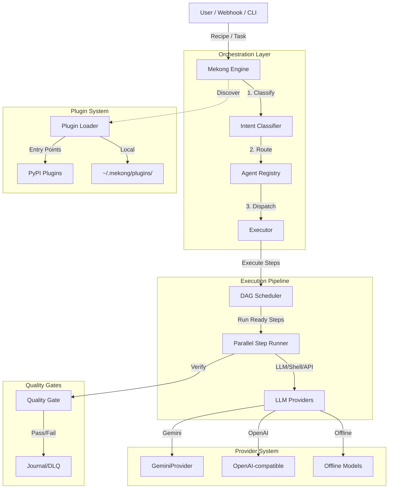

# System Architecture: Mekong CLI v3.0.0

## 1. High-Level Overview

Mekong CLI v3.0.0 is an AGI Vibe Coding Factory framework with type-safe agents, pluggable LLM providers, and parallel recipe execution via DAG scheduling.

### Architecture Diagram



## 2. Core Components

### 2.1. Package Structure
- **mekong/** shim (PyPI entry point, `import mekong` works)
- **src/core/** implementation:
  - `protocols.py` — AgentProtocol (runtime-checkable), StreamingMixin
  - `agent_registry.py` — Type-safe agent registration & lookup
  - `providers.py` — Abstract LLMProvider + built-in implementations
  - `dag_scheduler.py` — Topological DAG execution (ThreadPoolExecutor)
  - `plugin_loader.py` — Discover plugins from entry_points + ~/.mekong/plugins/
  - `orchestrator.py` — Plan→Execute→Verify coordination
  - `verifier.py` — Quality gate validation

### 2.2. Agent Protocol System (Phase 1)
- **File**: `src/core/protocols.py`
- **Runtime-checkable**: Agents implement `plan(input) → Task[]`, `execute(task) → Result`, `verify(result) → bool`
- **Streaming**: Optional `execute_stream()` for async token-by-token output
- **Registry**: Agents registered by name in `AgentRegistry`, lookup returns protocol-compliant object

### 2.3. DAG Scheduler (Phase 2)
- **File**: `src/core/dag_scheduler.py`
- **Topological Sort**: Identifies ready steps (all dependencies completed)
- **Parallel Execution**: ThreadPoolExecutor up to `max_workers` (default: 4)
- **Failure Handling**: Marks failed steps, cancels downstream dependents transitively
- **Recipe Steps**: Each step has `.order`, `.dependencies`, `.params`, `.rollback()`

### 2.4. LLM Provider Abstraction (Phase 3)
- **File**: `src/core/providers.py`
- **Built-in**: GeminiProvider, OpenAICompatibleProvider, OfflineProvider
- **Interface**: `.chat(messages, model, temperature, max_tokens, json_mode) → LLMResponse`
- **Failover**: Circuit-breaker routing, automatic fallback (e.g., quota → next provider)
- **Config**: Via env vars or provider-specific settings

### 2.5. Autonomous Daemon (Phase 4)
- **Path**: `src/daemon/`
- **Components**:
  - `watcher.py` — File system monitoring for new tasks
  - `classifier.py` — Intent classification (pre-route to agents)
  - `executor.py` — Task execution wrapper
  - `gate.py` — Quality gate enforcement
  - `journal.py` — Execution journaling (success/failure tracking)
  - `dlq.py` — Dead letter queue for failed tasks (no auto-retry)
- **Flow**: Watcher → Classifier → Executor → Gate → Journal/DLQ

### 2.6. Plugin System (Phase 5)
- **File**: `src/core/plugin_loader.py`
- **Discovery Methods**:
  1. **Entry Points**: Plugins in other packages via `[project.entry-points."mekong.agents"]`
  2. **Local Plugins**: `.py` files in `~/.mekong/plugins/` directory
- **Registration**: Plugins call `registry.register(name, cls)` in `register(registry)` function
- **Safety**: Plugin failures logged as warnings (never crash CLI)

### 2.7. Package Shim for PyPI (Phase 6)
- **mekong/ package** allows `import mekong` to work
- **Symlinks** to `src/core/` modules for user convenience
- **Entry point**: `mekong` command in shell (via `pyproject.toml [tool.poetry.scripts]`)

## 3. Data Flow & Execution

### Recipe Execution (Plan → Execute → Verify)
1. **Parse Recipe** → Extract steps, dependencies, instructions from Markdown/JSON
2. **DAG Schedule** → Build dependency graph, identify ready steps
3. **Parallel Exec** → ThreadPoolExecutor runs independent steps concurrently
4. **Provider Failover** → If LLM fails, circuit-breaker tries next available provider
5. **Gate Check** → Verify output meets quality criteria (lint, type check, tests)
6. **Journal Log** → Record success/failure with execution context
7. **DLQ Handling** → Failed tasks go to dead letter queue (operator review, no auto-retry)

### Recipe Step Example
```yaml
steps:
  - order: 1
    dependencies: []
    cmd: "git status"
  - order: 2
    dependencies: [1]
    cmd: "npm build"  # waits for step 1
  - order: 3
    dependencies: [1]
    cmd: "npm test"   # waits for step 1, runs parallel with step 2
```

### Execution Timeline
```
Step 1: ↓       (order=1, no deps)
Step 2: ----↓   (order=2, depends on 1)
Step 3: ----↓   (order=3, depends on 1, parallel with 2)
```

## 4. Configuration & Runtime

### Environment Variables
- `LLM_BASE_URL` — Provider endpoint (default: `http://localhost:9191`)
- `LLM_PROVIDER` — Active provider: `gemini`, `openai`, `offline`
- `MEKONG_PLUGIN_DIR` — Plugin directory (default: `~/.mekong/plugins/`)
- `LOG_LEVEL` — Logging: `debug`, `info`, `warning`, `error`

### Plugin Registration Example
```python
# ~/.mekong/plugins/my_custom_agent.py
from src.core.protocols import AgentProtocol

class MyAgent:
    name = "my-agent"
    def plan(self, input_data: str) -> list: ...
    def execute(self, task) -> dict: ...
    def verify(self, result) -> bool: ...

def register(registry):
    registry.register("my-agent", MyAgent)
```

### Provider Configuration
```python
# Custom provider (subclass LLMProvider)
from src.core.providers import LLMProvider, LLMResponse

class CustomProvider(LLMProvider):
    @property
    def name(self) -> str:
        return "custom"

    def chat(self, messages, model, temperature, max_tokens, json_mode) -> LLMResponse:
        # Implement your logic
        return LLMResponse(content="...", model=model)
```

## 5. Bảo Mật & An Toàn

- **Sandbox**: CC CLI chạy trong môi trường được kiểm soát quyền (mặc dù cờ `--dangerously-skip-permissions` được bật để tự động hóa, nhưng Tôm Hùm giám sát chặt chẽ).
- **Network Isolation**: Proxy chỉ cho phép các kết nối từ localhost hoặc các IP tin cậy.
- **Resource Limits**: Daemon giám sát RAM và Nhiệt độ CPU để ngăn chặn quá tải trên thiết bị Edge (MacBook M1).

## 6. AGI Integration Layer (v2026.2.28)

Three optional components that upgrade the orchestration engine with semantic memory, distributed tracing, and self-healing capabilities. Each degrades gracefully when the backing service is unavailable.

| Component | Tool | Package | Port | Status |
|-----------|------|---------|------|--------|
| Memory | Mem0 + Qdrant | `packages/memory/` | 6333 | Active |
| Observability | Langfuse | `packages/observability/` | 3100 | Active |
| Self-Healing | Aider CLI | `apps/openclaw-worker/lib/aider-bridge.js` | — | Spike |
| Orchestration | LangGraph | — | — | Deferred |
| Marketplace | — | — | — | Deferred v2 |

### Fallback Chain

```
Memory:        Mem0+Qdrant  →  YAML MemoryStore (always available)
Observability: Langfuse     →  TelemetryCollector JSON (always available)
Self-Healing:  Aider CLI    →  CC CLI mission dispatch (always available)
```

### Infrastructure

```bash
# Start all AGI services (Qdrant + Langfuse)
docker compose -f docker/docker-compose.agi.yml up -d
```

Full setup guide: `docs/agi-integration.md`
