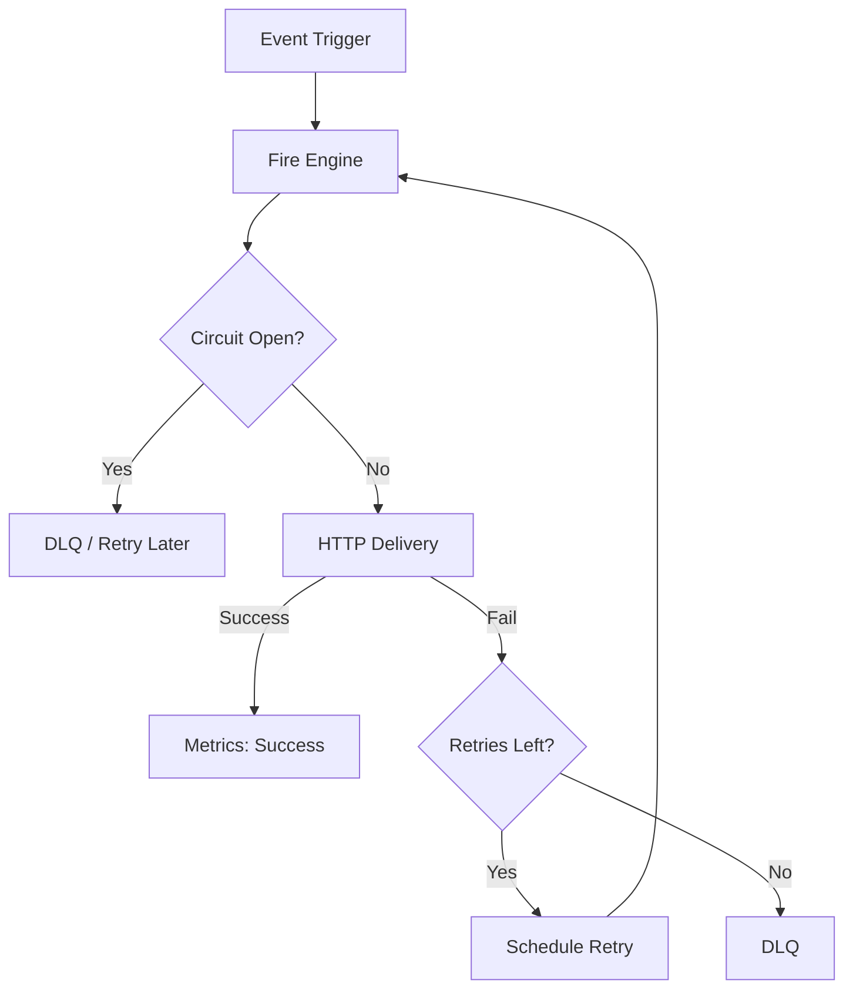

# Webhook Fire Attack Protocol (Ch.12)

> **"Use fire to assist attacks"** - Aggressive, reliable, and observable webhook delivery system.

## 1. Overview

The Webhook Fire Attack system ensures 99.9% delivery reliability through a layered defense-in-depth approach:
1.  **Direct Attack**: Immediate delivery attempt.
2.  **Fire Escalation**: Exponential backoff with jitter.
3.  **Circuit Breaker**: Preventing system exhaustion during outages.
4.  **Dead Letter Queue (DLQ)**: The "hospital" for failed events.

## 2. Architecture



### Components
- **Fire Engine** (`WebhookFireEngine`): Orchestrates the entire delivery lifecycle.
- **Retry Worker**: Background process scanning for pending retries.
- **Circuit Breaker**: Redis-backed state machine (OPEN/CLOSED/HALF-OPEN).
- **Signature Service**: HMAC-SHA256 signing for security.

## 3. Retry Strategy

We use **Exponential Backoff with Jitter** to prevent "Thundering Herd" problems.

| Attempt | Base Delay | With Jitter (±20%) | Timeout |
|---------|------------|--------------------|---------|
| 1       | 0s (Immediate)| -               | 5s      |
| 2       | 1s         | 0.8s - 1.2s        | 5s      |
| 3       | 2s         | 1.6s - 2.4s        | 10s     |
| 4       | 4s         | 3.2s - 4.8s        | 10s     |
| 5       | 8s         | 6.4s - 9.6s        | 20s     |
| 6       | 16s        | 12.8s - 19.2s      | 20s     |
| 7       | 32s        | 25.6s - 38.4s      | 20s     |

**Max Retries:** 7 (Total duration ~2-3 minutes coverage, customizable).

## 4. Circuit Breaker

Prevents wasting resources on dead endpoints.

- **Threshold**: 5 failures in a rolling window.
- **Cooldown**: 30 seconds.
- **Half-Open**: Allows 1 probe request. 3 successes required to Close.

## 5. Operational Runbook

### Handling DLQ Entries
1.  Navigate to `/admin/webhooks/dlq`.
2.  Review error messages (e.g., "HTTP 500", "Timeout").
3.  **Fix**: Contact the receiving party or update the webhook URL.
4.  **Replay**: Select entries and click "Replay".
5.  **Discard**: If the event is no longer relevant.

### Monitoring Health
- Dashboard: `/admin/webhooks/health`
- **Success Rate**: Should be > 99%.
- **Latency**: Typically < 500ms.
- **Alerts**: Configured for Success Rate < 95%.

## 6. Configuration

Managed via `config/webhook-fire-config.yaml`.

```yaml
webhook_fire:
  retry_policy:
    max_retries: 7
  circuit_breaker:
    failure_threshold: 5
```

## 7. Security

- All payloads signed with `AgencyOS-Signature` header.
- Format: `t=TIMESTAMP,v1=SIGNATURE`.
- Clients must verify signature using their secret.

---
**Status**: Production Ready
**Date**: 2026-01-27
**Author**: Backend Team
