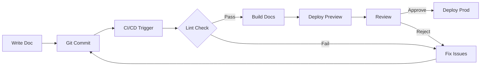

# 📚 DocsOps - Documentation Operations Framework

> **Version:** 1.0 | **Last Updated:** 2026-01-05
> **Scope:** AgencyOS Documentation Infrastructure

---

## 🏗️ Architecture Overview

```
docsops/
├── 📖 user/                    # End-user documentation
│   ├── onboarding/             # Getting started guides
│   ├── tutorials/              # Step-by-step tutorials
│   └── faq/                    # Frequently asked questions
│
├── 👨‍💻 developer/              # Technical documentation
│   ├── api/                    # API reference
│   ├── architecture/           # System design docs
│   └── contributing/           # Contribution guidelines
│
├── 💼 sales/                   # Sales & marketing docs
│   ├── pitch-decks/            # Investor presentations
│   ├── case-studies/           # Success stories
│   └── pricing/                # Pricing documentation
│
├── 🏢 internal/                # Internal team docs
│   ├── sops/                   # Standard Operating Procedures
│   ├── reports/                # Analysis reports
│   └── runbooks/               # Operational runbooks
│
├── ⚖️ compliance/              # Legal & compliance
│   ├── privacy/                # Privacy policies
│   ├── terms/                  # Terms of service
│   └── security/               # Security policies
│
├── 📝 templates/               # Document templates
│   └── [15 templates]
│
└── 🔄 workflows/               # Automation configs
    └── [CI/CD pipelines]
```

---

## 📊 Document Categories (15 Types)

| # | Category | Type | Template |
|---|----------|------|----------|
| 1 | Onboarding Guide | User | `TEMPLATE_ONBOARDING.md` |
| 2 | Tutorial | User | `TEMPLATE_TUTORIAL.md` |
| 3 | FAQ | User | `TEMPLATE_FAQ.md` |
| 4 | API Reference | Developer | `TEMPLATE_API.md` |
| 5 | Architecture | Developer | `TEMPLATE_ARCHITECTURE.md` |
| 6 | Contributing | Developer | `TEMPLATE_CONTRIBUTING.md` |
| 7 | Pitch Deck | Sales | `TEMPLATE_PITCH.md` |
| 8 | Case Study | Sales | `TEMPLATE_CASE_STUDY.md` |
| 9 | Pricing Guide | Sales | `TEMPLATE_PRICING.md` |
| 10 | SOP | Internal | `TEMPLATE_SOP.md` |
| 11 | Report | Internal | `TEMPLATE_REPORT.md` |
| 12 | Runbook | Internal | `TEMPLATE_RUNBOOK.md` |
| 13 | Privacy Policy | Compliance | `TEMPLATE_PRIVACY.md` |
| 14 | Terms of Service | Compliance | `TEMPLATE_TERMS.md` |
| 15 | Security Policy | Compliance | `TEMPLATE_SECURITY.md` |

---

## 🔄 DocsOps Workflow



---

## 🚀 Quick Start

### Create New Document
```bash
# Copy template
cp docsops/templates/TEMPLATE_TUTORIAL.md docsops/user/tutorials/my-tutorial.md

# Edit with your content
code docsops/user/tutorials/my-tutorial.md

# Commit
git add . && git commit -m "docs: Add my-tutorial"
```

### Run Docs Server
```bash
# Development
npm run docs:dev

# Build
npm run docs:build
```

---

## 📏 Style Guide

### Formatting
- **Headers**: Use `#` hierarchy (max 4 levels)
- **Code blocks**: Always specify language
- **Links**: Use relative paths when possible
- **Images**: Store in `/public/images/docs/`

### Naming Conventions
- **Files**: `kebab-case.md`
- **Directories**: `lowercase`
- **Templates**: `TEMPLATE_TYPE.md`

### Metadata
Every doc should have frontmatter:
```yaml
---
title: Document Title
description: Brief description
author: Name
created: YYYY-MM-DD
updated: YYYY-MM-DD
category: user|developer|sales|internal|compliance
---
```

---

## 📊 Metrics Tracked

| Metric | Description |
|--------|-------------|
| **Doc Count** | Total documents per category |
| **Freshness** | Days since last update |
| **Coverage** | % of features documented |
| **Views** | Page views (via analytics) |
| **Feedback** | Helpfulness ratings |

---

## 🔗 Related Resources

- [HUONG_DAN_BAT_DAU_VN.md](/docs/HUONG_DAN_BAT_DAU_VN.md) - Vietnamese guide
- [ARCHITECTURE_DIAGRAM.md](/docs/ARCHITECTURE_DIAGRAM.md) - System diagrams
- [ENV_CHECKLIST.md](/docs/ENV_CHECKLIST.md) - Environment setup

---

*DocsOps Framework v1.0 - AgencyOS*
