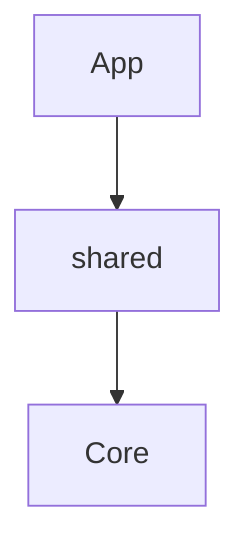

# Mekong shared 🌊


> Part of the **Mekong CLI Hub** - RaaS Agency Operating System

## 📦 Installation

```bash
npm install @mekong/shared
```

## 🏗 Architecture



## 🚀 Usage

```typescript
import { something } from '@mekong/shared';

// Use it
```
