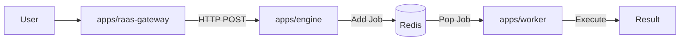

# Plan: Engine Layer Implementation (AgencyOS RaaS)

> **Status**: Completed
> **Priority**: Critical
> **Owner**: Antigravity
> **Date**: 2026-02-06

## 1. Objective
Implement the missing **Engine Layer** for AgencyOS Results-as-a-Service (RaaS) platform, aligning with the Hub-and-Spoke architecture defined in `MASTER_PRD_AGENCYOS_RAAS.md`. This involves establishing the infrastructure, the API layer (to receive requests from the Gateway), and the Worker layer (to execute jobs via BullMQ).

## 2. Context
- **Current State**:
  - `apps/raas-gateway` exists (Cloudflare Worker).
  - `apps/openclaw-worker` exists (Local Bridge/Telegram Bot - "Viral Layer").
  - `infrastructure/` exists (Docker Compose for Redis & Postgres).
  - `apps/engine` exists (Node.js API).
  - `apps/worker` exists (Node.js Worker).
- **Goal State**:
  - `infrastructure/` contains Docker Compose for Redis & Postgres.
  - `apps/engine` (new) receives HTTP requests from Gateway and adds jobs to Queue.
  - `apps/worker` (new) processes jobs from Queue.

## 3. Architecture

## 4. Phases

### [Phase 1: Infrastructure Setup](./phase-01-infrastructure-setup.md) (Completed)
**Goal**: Establish the local runtime environment (Redis, Postgres).
- [x] Create `infrastructure/` directory.
- [x] Create `docker-compose.yml` (Redis + Postgres).
- [x] Configure environment variables.

### [Phase 2: Engine API Service](./phase-02-engine-api-setup.md) (Completed)
**Goal**: Create the Node.js service that accepts tasks from the Gateway.
- [x] Create `apps/engine` (Node.js + Fastify).
- [x] Implement `POST /v1/chat/completions` (OpenAI compatible).
- [x] Implement BullMQ Producer logic.
- [x] Secure with Service Token.
- [x] Dockerize service.

### [Phase 3: Worker Service](./phase-03-worker-setup.md) (Completed)
**Goal**: Create the background worker that executes the tasks.
- [x] Create `apps/worker` (Node.js).
- [x] Implement BullMQ Consumer.
- [x] Implement basic "Mock" execution (to verify flow).
- [x] Dockerize service.

### [Phase 4: Integration & Verification](./phase-04-integration-verification.md) (Completed)
**Goal**: Verify the end-to-end flow.
- [x] Update `apps/raas-gateway` (Config verified).
- [x] Create Integration Test Script (`test-engine-integration.sh`).
- [x] Create Docker Test Script (`test-engine-docker.sh`).
- [x] Update `docker-compose.yml` to include Engine & Worker.

## 5. Timeline
- **Phase 1**: Completed
- **Phase 2**: Completed
- **Phase 3**: Completed
- **Phase 4**: Completed

## 6. Risks
- **Cloudflare <-> Localhost**: Networking complexity during local dev.
- **Redis Connection**: Ensuring all services can reach Redis.
