# Kế Hoạch Tái Cấu Trúc Monorepo Mekong-CLI

**Ngày:** 2026-03-09 | **Nhánh:** master | **Mức độ:** STRATEGIC (5 phases)

## Tình Trạng Hiện Tại: "Đám Rừng"

| Chỉ số | Giá trị | Đánh giá |
|--------|---------|----------|
| apps/ | **35 thư mục** (9 submodule, 26 local) | Quá nhiều, lẫn lộn |
| packages/ | **115 thư mục** (52 chỉ có ≤5 files = stub) | ~50% rỗng/stub |
| Root dirs rogue | **19 thư mục** (antigravity, api, backend, cli, core, frontend...) | Không thuộc chuẩn monorepo |
| Root files rogue | ~30 files (build logs, test outputs, 83MB repomix-output.xml) | Rác ở root |
| Hidden dirs | **25+** (.ag_proxies, .agencyos, .agent, .antigravity, .archive, .claude-flow, .claude-skills, .clawhub, .cleo, .entire, .opencode, .playwright-mcp, .swarm, .taskmaster...) | Phình tạo |
| Dual language | Python (CLI core) + Node.js (openclaw, apps) | Chấp nhận được |
| Submodules | 10 (sophia, 84tea, apex-os, well, anima119, com-anh-duong x2, gemini-proxy-clone, cleo, serena, starter-template, n8n-mcp) | Quá nhiều |

## Kiến Trúc Đề Xuất

```mermaid
graph TB
    subgraph "mekong-cli/ (Root)"
        ROOT[pyproject.toml + package.json<br/>Turborepo + Poetry]
    end

    subgraph "apps/ (Deployable Units)"
        A1[openclaw-worker<br/>Node.js - CTO Daemon]
        A2[algo-trader<br/>Node.js - Trading Bot]
        A3[raas-gateway<br/>Node.js - RaaS API]
        A4[dashboard<br/>React - Admin UI]
        A5[web<br/>Next.js - Marketing]
    end

    subgraph "external/ (Submodules)"
        E1[sophia-ai-factory]
        E2[well]
        E3[84tea]
        E4[apex-os]
        E5[anima119]
    end

    subgraph "packages/ (Shared Libraries)"
        P1[core<br/>Shared types, utils]
        P2[billing<br/>Stripe/Polar SDK]
        P3[trading-core<br/>Exchange connectors]
        P4[agents<br/>Agent framework]
        P5[ui<br/>Shared React components]
        P6[auth<br/>Auth/JWT utilities]
        P7[observability<br/>Logging, metrics]
    end

    subgraph "src/ (Python CLI)"
        S1[cli/ - Typer commands]
        S2[core/ - Plan-Execute-Verify]
        S3[agents/ - Python agents]
        S4[raas/ - RaaS client]
    end

    subgraph "infra/ (DevOps)"
        I1[docker/]
        I2[scripts/]
        I3[config/]
    end

    ROOT --> A1 & A2 & A3 & A4 & A5
    ROOT --> E1 & E2 & E3 & E4 & E5
    ROOT --> P1 & P2 & P3 & P4 & P5 & P6 & P7
    ROOT --> S1 & S2 & S3 & S4
    ROOT --> I1 & I2 & I3

    A1 --> P1 & P7
    A2 --> P1 & P3 & P2
    A3 --> P1 & P2 & P6
    A4 --> P1 & P5 & P6
    A5 --> P1 & P5
```



## Phases

| # | Phase | File | Ưu tiên | Trạng thái |
|---|-------|------|---------|-----------|
| **0** | **[RaaS Unification — PUBLIC vs PRIVATE](phase-00-raas-unification.md)** | phase-00 | **SUPREME** | DONE |
| **0A** | **[Tach Private Code → agencyos-sdk](phase-0a-extract-public.md)** | phase-0a | **P0** | DONE |
| 0B | Prune stubs + legacy (83 packages xóa, 351 files) | phase-0b | P0 | DONE |
| 0C | @mekong/raas SDK (license gate + Polar checkout) | phase-0c | P1 | DONE |
| 0D | WOW README + push GitHub | phase-0d | P2 | DONE |
| 1 | [Dọn rác root + rogue files](phase-01-clean-root.md) | phase-01 | P0 (gộp vào 0B) | DONE (gộp) |
| 2 | [Cắt tỉa packages/ (xóa stubs)](phase-02-prune-packages.md) | phase-02 | P0 (gộp vào 0B) | DONE (gộp) |
| 3 | [Di dời root dirs vào đúng vị trí](phase-03-relocate-dirs.md) | phase-03 | P1 (gộp vào 0A) | DONE (gộp) |
| 4 | [Tách submodules ra external/](phase-04-organize-apps.md) | phase-04 | P1 (gộp vào 0A) | DONE (gộp) |
| 5 | [Chuẩn hóa build + workspace config](phase-05-standardize-build.md) | phase-05 | P2 (phase cuối) | DONE |

**CHÚ Ý:** Phase 0 (RaaS Unification) thay đổi toàn bộ chiến lược. Phase 1-4 được gộp vào sub-phases 0A/0B. Phase 5 chạy cuối.

## Nguyên Tắc

1. **Không phá production** — mỗi phase phải test pass trước khi merge
2. **Atomic commits** — mỗi thay đổi là 1 commit rõ ràng
3. **Backward compatible** — giữ symlink/re-export khi cần
4. **Python CLI không ảnh hưởng** — src/ giữ nguyên cấu trúc

## Rủi Ro

- `apps/openclaw-worker` phụ thuộc path cứng vào root → cần cập nhật config.js
- 10 submodules có thể break khi di chuyển → test từng cái
- `frontend/` 30K files có thể là node_modules bị commit → kiểm tra
- 52 stub packages nếu xóa → cần kiểm tra có app nào import không

## Phát Hiện Bổ Sung (Từ 3 Researcher Agents)

### Critical Issues
1. **Namespace conflict**: `@agencyos/*` (algo-trader) vs `@mekong/*` (well) → thống nhất 1 scope
2. **`apps/gemini-proxy-clone/turbo.json`** thiếu `extends` → phá monorepo build
3. **3 orphaned git worktrees** trong `.claude/worktrees/agent-*` (42 duplicate files)
4. **`.archive/doanh-trai-tom-hum/node_modules/`** bị commit vào git
5. **`apps/*/Users/`** — absolute path directories bị commit (algo-trader, com-anh-duong-10x)

### Dependency Issues
- Zod version mismatch: v3.25 (well) vs v4.3 (other packages)
- ESLint major conflict: v8.57 vs v9.39 coexist
- Python CLI hoàn toàn độc lập (no cross-import) ← tốt

### Code Quality
- 3 duplicate `spawnBrain` implementations (headless, terminal-app, vscode-terminal)
- 12 Python files >600 lines (raas_auth.py: 1208 lines!)
- 10 JS files >400 lines (auto-cto-pilot.js: 835 lines)
- 4 overlapping registry implementations
- Runtime state files (.mekong/, .antigravity/) committed to git

## Thống Kê Tổng Quan

### Trước Tái Cấu Trúc (Hiện Tại)
```
Root:      ~30 rogue files + 19 rogue dirs + 25 hidden dirs
apps/:     35 (9 submodule + ~17 legacy/stub + ~8 production)
packages/: 115 (~52 stub ≤5 files + ~30 hub-sdk stubs + ~15 thực sự)
scripts/:  215 files (chưa phân loại)
Total:     Hỗn loạn
```

### Sau Tái Cấu Trúc (Mục Tiêu)
```
Root:      Chỉ config files + README
apps/:     ~8 production apps
external/: ~8 submodules (tách riêng)
packages/: ~15-20 shared libraries (@mekong/ scope)
infra/:    docker + scripts + config + supabase
src/:      Python CLI (giữ nguyên)
docs/:     Tập trung documentation
Total:     Quân đội có tổ chức
```

### Tiến Độ Thực Hiện

| Phase | Tên | Effort | Phụ thuộc |
|-------|-----|--------|-----------|
| 1 | Dọn rác root | ~1h | Không |
| 2 | Cắt tỉa packages | ~2h | Phase 1 |
| 3 | Di dời root dirs | ~3h | Phase 1 |
| 4 | Tổ chức apps | ~2h | Phase 3 |
| 5 | Chuẩn hóa build | ~2h | Phase 2+3+4 |

**Tổng ước tính: ~10h làm việc, chia thành 5 commits riêng biệt.**

## Lệnh Thực Thi

```bash
# Phase 1
/cook "Phase 1 monorepo restructure: dọn rác root files, cập nhật gitignore" --auto

# Phase 2
/cook "Phase 2 monorepo restructure: cắt tỉa packages/, xóa hub-sdk stubs, gộp trùng lặp" --auto

# Phase 3
/cook "Phase 3 monorepo restructure: di dời root dirs (frontend, api, backend, antigravity, scripts, docker, config) vào đúng vị trí" --auto

# Phase 4
/cook "Phase 4 monorepo restructure: tách submodules ra external/, archive legacy apps" --auto

# Phase 5
/cook "Phase 5 monorepo restructure: chuẩn hóa build system, workspace config, naming convention" --auto
```
