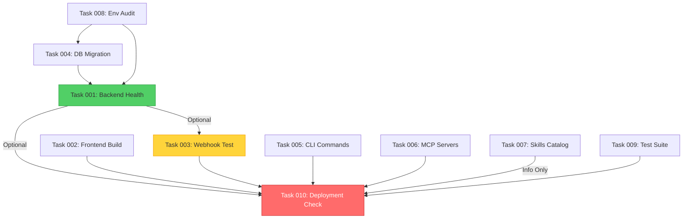

# TERMINAL EXECUTION PLAN - Parallel Implementation

**Generated:** 2026-01-25
**Purpose:** Atomic, parallelizable tasks for multiple terminal sessions
**Dependency:** Read `ARCHITECTURE_MASTER_PLAN.md` first

---

## EXECUTION STRATEGY

**Total Tasks:** 10
**Parallelization:** 10 independent terminals
**Estimated Time:** 2-4 hours (all terminals running concurrently)
**Prerequisites:** None (all tasks are atomic and independent)

---

## TASK 001: BACKEND API HEALTH VALIDATION

**Terminal:** #1
**Time:** 15-20 minutes
**Dependencies:** None
**Failure Impact:** Medium (blocks deployment)

### Objective
Validate all backend API endpoints are functional and return expected responses.

### Commands
```bash
cd /Users/macbookprom1/mekong-cli/backend

# Activate venv (if exists)
source .venv/bin/activate 2>/dev/null || python3 -m venv .venv && source .venv/bin/activate

# Install dependencies
pip install -r requirements.txt

# Start backend server (background)
uvicorn main:app --host 0.0.0.0 --port 8000 &
BACKEND_PID=$!

# Wait for startup
sleep 5

# Test critical endpoints
curl -f http://localhost:8000/health || echo "FAIL: Health endpoint"
curl -f http://localhost:8000/api/revenue/dashboard || echo "FAIL: Revenue endpoint"
curl -f -X POST http://localhost:8000/api/payments/paypal/webhook \
  -H "Content-Type: application/json" \
  -d '{"test": true}' || echo "FAIL: PayPal webhook"

# Stop backend
kill $BACKEND_PID

# Report results
echo "Backend API validation complete. Check output above for FAIL messages."
```

### Success Criteria
- Health endpoint returns 200 OK
- Revenue endpoint returns JSON
- Webhook endpoint returns 400/401 (expected without valid signature)

### Failure Recovery
- Check `backend/logs/` for errors
- Verify `.env` file exists with required keys
- Ensure PostgreSQL/Supabase connection

---

## TASK 002: FRONTEND BUILD VERIFICATION

**Terminal:** #2
**Time:** 10-15 minutes
**Dependencies:** None
**Failure Impact:** High (blocks deployment)

### Objective
Verify all 3 frontend apps build without errors.

### Commands
```bash
cd /Users/macbookprom1/mekong-cli

# Install dependencies
pnpm install

# Build apps sequentially (report each)
echo "=== Building Dashboard ==="
cd apps/dashboard && pnpm build && cd ../..

echo "=== Building Docs ==="
cd apps/docs && pnpm build && cd ../..

echo "=== Building Web ==="
cd apps/web && pnpm build && cd ../..

echo "All builds complete. Check above for errors."
```

### Success Criteria
- No TypeScript errors
- No build failures
- Output directories created (`.next/`, `dist/`)

### Failure Recovery
- Run `pnpm install` in failing app directory
- Check for missing dependencies in `package.json`
- Verify Node.js version (v18+)

---

## TASK 003: PAYMENT WEBHOOK INTEGRATION TEST

**Terminal:** #3
**Time:** 20-25 minutes
**Dependencies:** Backend running (spawn separate process)
**Failure Impact:** Critical (blocks payment processing)

### Objective
Simulate PayPal/Stripe webhooks and verify processing logic.

### Commands
```bash
cd /Users/macbookprom1/mekong-cli/backend

# Start backend (if not running from Task 001)
source .venv/bin/activate
uvicorn main:app --host 0.0.0.0 --port 8000 &
BACKEND_PID=$!
sleep 5

# Test PayPal webhook (invalid signature - should fail gracefully)
curl -X POST http://localhost:8000/api/payments/paypal/webhook \
  -H "Content-Type: application/json" \
  -H "PAYPAL-TRANSMISSION-ID: fake-id" \
  -d '{
    "event_type": "PAYMENT.CAPTURE.COMPLETED",
    "resource": {
      "id": "test-payment-id",
      "amount": {
        "value": "100.00",
        "currency_code": "USD"
      }
    }
  }'

# Test Stripe webhook (invalid signature - should fail gracefully)
curl -X POST http://localhost:8000/api/payments/stripe/webhook \
  -H "Content-Type: application/json" \
  -H "Stripe-Signature: fake-signature" \
  -d '{
    "type": "payment_intent.succeeded",
    "data": {
      "object": {
        "id": "pi_test_123",
        "amount": 10000,
        "currency": "usd"
      }
    }
  }'

# Stop backend
kill $BACKEND_PID

echo "Webhook integration test complete. Verify 401/400 responses above."
```

### Success Criteria
- Endpoints return 401 Unauthorized (invalid signature)
- No server crashes
- Logs show signature verification attempts

### Failure Recovery
- Check `backend/services/payment_service.py` for signature verification logic
- Verify webhook routes in `backend/api/payments/`
- Review error logs in `backend/logs/`

---

## TASK 004: DATABASE MIGRATION VALIDATION

**Terminal:** #4
**Time:** 10-15 minutes
**Dependencies:** Supabase credentials in `.env`
**Failure Impact:** High (data integrity)

### Objective
Verify database schema matches application models.

### Commands
```bash
cd /Users/macbookprom1/mekong-cli/backend

source .venv/bin/activate

# Generate Alembic migration (dry run)
alembic revision --autogenerate -m "Validation check" || echo "No Alembic setup - check manually"

# Alternative: Check Supabase schema directly
# (Requires supabase CLI or direct DB connection)

# Verify critical tables exist
python3 << 'EOF'
from supabase import create_client
import os

url = os.getenv("SUPABASE_URL")
key = os.getenv("SUPABASE_ANON_KEY")

if url and key:
    client = create_client(url, key)

    # Check tables (adjust table names as needed)
    tables = ["subscriptions", "invoices", "licenses", "users"]
    for table in tables:
        try:
            result = client.table(table).select("*").limit(1).execute()
            print(f"✓ Table '{table}' exists")
        except Exception as e:
            print(f"✗ Table '{table}' missing or error: {e}")
else:
    print("Missing SUPABASE_URL or SUPABASE_ANON_KEY in .env")
EOF
```

### Success Criteria
- All critical tables exist
- No migration conflicts
- Schema matches Pydantic models

### Failure Recovery
- Run `alembic upgrade head` if migrations pending
- Check Supabase dashboard for table definitions
- Review `backend/models/` for schema definitions

---

## TASK 005: CLI COMMAND VERIFICATION

**Terminal:** #5
**Time:** 15-20 minutes
**Dependencies:** None
**Failure Impact:** Medium (user experience)

### Objective
Verify all `cc` commands are functional and return valid output.

### Commands
```bash
cd /Users/macbookprom1/mekong-cli

# Test core commands (dry run mode where possible)
cc --help || echo "FAIL: cc command not found"

# Revenue commands
cc revenue dashboard --dry-run || echo "FAIL: Revenue dashboard"
cc revenue forecast --dry-run || echo "FAIL: Revenue forecast"

# Sales commands
cc sales products-list || echo "FAIL: Products list"

# Deploy commands
cc deploy health || echo "FAIL: Deploy health check"

# Finance commands
cc finance invoice-list || echo "FAIL: Invoice list"

# Content commands
cc content generate --dry-run --topic "Test" || echo "FAIL: Content generation"

echo "CLI command verification complete. Check above for FAIL messages."
```

### Success Criteria
- `cc --help` displays usage
- Commands return expected output or dry-run confirmation
- No Python import errors

### Failure Recovery
- Check `antigravity/cli/` for command implementations
- Verify Python path includes `antigravity/`
- Review command routing in `antigravity/cli/__main__.py`

---

## TASK 006: MCP SERVER CONNECTIVITY TEST

**Terminal:** #6
**Time:** 20-30 minutes
**Dependencies:** MCP servers must be running
**Failure Impact:** High (agent orchestration)

### Objective
Verify all 14 MCP servers are reachable and responding.

### Commands
```bash
cd /Users/macbookprom1/mekong-cli

# Start MCP servers (background processes)
# Adjust paths/commands as needed based on actual server implementation

# Test each server (example - adjust URLs/ports)
MCP_SERVERS=(
  "agency_server:8081"
  "revenue_server:8082"
  "security_server:8083"
  "orchestrator_server:8084"
  "quota_server:8085"
  "coding_server:8086"
  "marketing_server:8087"
  "network_server:8088"
  "solo_revenue_server:8089"
  "recovery_server:8090"
  "sync_server:8091"
  "ui_server:8092"
  "workflow_server:8093"
  "commander_server:8094"
)

for server in "${MCP_SERVERS[@]}"; do
  name="${server%%:*}"
  port="${server##*:}"

  curl -f http://localhost:$port/health 2>/dev/null && \
    echo "✓ $name (port $port) OK" || \
    echo "✗ $name (port $port) FAIL"
done

echo "MCP server connectivity test complete."
```

### Success Criteria
- All 14 servers return 200 OK on `/health`
- No connection refused errors

### Failure Recovery
- Check `antigravity/mcp_servers/` for server implementations
- Verify servers are started (check process list: `ps aux | grep mcp`)
- Review server logs for startup errors

---

## TASK 007: SKILLS CATALOG VALIDATION

**Terminal:** #7
**Time:** 10-15 minutes
**Dependencies:** None
**Failure Impact:** Low (documentation)

### Objective
Verify all 48 skills have valid `SKILL.md` files and directory structure.

### Commands
```bash
cd /Users/macbookprom1/mekong-cli

# Check .claude-skills/
echo "=== Checking .claude-skills/ ==="
SKILL_COUNT=$(find .claude-skills -name "SKILL.md" | wc -l)
echo "Found $SKILL_COUNT skills in .claude-skills/"

for skill_dir in .claude-skills/*/; do
  skill_name=$(basename "$skill_dir")

  if [ ! -f "$skill_dir/SKILL.md" ]; then
    echo "✗ Missing SKILL.md: $skill_name"
  else
    echo "✓ $skill_name"
  fi

  # Check for scripts/ directory
  if [ ! -d "$skill_dir/scripts" ]; then
    echo "  ⚠ Missing scripts/ directory: $skill_name"
  fi
done

# Check .agencyos/skills/ (should mirror .claude-skills/)
echo ""
echo "=== Checking .agencyos/skills/ ==="
AGENCYOS_SKILL_COUNT=$(find .agencyos/skills -name "SKILL.md" 2>/dev/null | wc -l || echo "0")
echo "Found $AGENCYOS_SKILL_COUNT skills in .agencyos/skills/"

echo ""
echo "Skills catalog validation complete."
```

### Success Criteria
- All skill directories have `SKILL.md`
- `.claude-skills/` and `.agencyos/skills/` are in sync
- No missing critical skills

### Failure Recovery
- Regenerate missing `SKILL.md` files using template
- Copy skills from `.claude-skills/` to `.agencyos/skills/` if missing

---

## TASK 008: ENVIRONMENT CONFIGURATION AUDIT

**Terminal:** #8
**Time:** 10-15 minutes
**Dependencies:** None
**Failure Impact:** Critical (secrets management)

### Objective
Verify all required environment variables are set and valid.

### Commands
```bash
cd /Users/macbookprom1/mekong-cli

# Check root .env
echo "=== Checking root .env ==="
if [ -f .env ]; then
  echo "✓ .env exists"

  # Check for required keys (adjust as needed)
  required_keys=(
    "SUPABASE_URL"
    "SUPABASE_ANON_KEY"
    "PAYPAL_CLIENT_ID"
    "PAYPAL_CLIENT_SECRET"
    "STRIPE_SECRET_KEY"
  )

  for key in "${required_keys[@]}"; do
    if grep -q "^$key=" .env; then
      value=$(grep "^$key=" .env | cut -d'=' -f2)
      if [ -n "$value" ] && [ "$value" != "your_*" ]; then
        echo "  ✓ $key is set"
      else
        echo "  ✗ $key is empty or placeholder"
      fi
    else
      echo "  ✗ $key is missing"
    fi
  done
else
  echo "✗ .env missing in root"
fi

# Check backend/.env
echo ""
echo "=== Checking backend/.env ==="
if [ -f backend/.env ]; then
  echo "✓ backend/.env exists"
else
  echo "✗ backend/.env missing"
  echo "  Copy from backend/.env.example"
fi

echo ""
echo "Environment configuration audit complete."
```

### Success Criteria
- All required environment variables are set
- No placeholder values in production
- Backend `.env` exists

### Failure Recovery
- Copy `.env.example` → `.env` and fill in values
- Check documentation for required API keys
- Verify Supabase project credentials

---

## TASK 009: TEST SUITE EXECUTION

**Terminal:** #9
**Time:** 15-25 minutes
**Dependencies:** Backend dependencies installed
**Failure Impact:** High (code quality)

### Objective
Run full test suite and generate coverage report.

### Commands
```bash
cd /Users/macbookprom1/mekong-cli/backend

source .venv/bin/activate

# Install test dependencies
pip install pytest pytest-cov pytest-asyncio

# Run unit tests
echo "=== Running Unit Tests ==="
pytest tests/unit/ -v --cov=backend --cov-report=term

# Run integration tests
echo ""
echo "=== Running Integration Tests ==="
pytest tests/integration/ -v

# Generate coverage report
echo ""
echo "=== Generating Coverage Report ==="
pytest --cov=backend --cov-report=html --cov-report=term

echo ""
echo "Test suite execution complete. Check htmlcov/index.html for detailed coverage."
```

### Success Criteria
- All tests pass
- Coverage ≥80% for backend
- No import errors

### Failure Recovery
- Fix failing tests in `backend/tests/`
- Check test logs for specific errors
- Verify test database/fixtures are set up

---

## TASK 010: DEPLOYMENT READINESS CHECK

**Terminal:** #10
**Time:** 15-20 minutes
**Dependencies:** All previous tasks completed
**Failure Impact:** Critical (production deployment)

### Objective
Final pre-deployment validation checklist.

### Commands
```bash
cd /Users/macbookprom1/mekong-cli

# Create deployment checklist
cat << 'EOF' > /tmp/deployment_checklist.md
# Deployment Readiness Checklist

## Backend
- [ ] All API endpoints return valid responses
- [ ] Database schema is up to date
- [ ] Payment webhooks verified (signature validation)
- [ ] Environment variables set (production)
- [ ] Tests pass (≥80% coverage)
- [ ] Docker image builds successfully

## Frontend
- [ ] All apps build without errors
- [ ] TypeScript type checking passes
- [ ] Production API URLs configured
- [ ] CDN assets optimized

## Infrastructure
- [ ] MCP servers running and healthy
- [ ] Redis cache connected
- [ ] Supabase connection tested
- [ ] Cloud Run deployment config validated
- [ ] GitHub Actions workflow tested

## Security
- [ ] Webhook signatures verified
- [ ] API rate limiting enabled
- [ ] CORS configured correctly
- [ ] Secrets stored in Secret Manager
- [ ] SSL certificates valid

## Monitoring
- [ ] Health check endpoint functional
- [ ] Logging configured (JSON format)
- [ ] Error tracking enabled (Sentry/etc)
- [ ] Metrics collection active

## Business Logic
- [ ] Vietnam tax calculation correct
- [ ] License generation functional
- [ ] Subscription billing tested
- [ ] Invoice generation works
- [ ] Email notifications sending

## Final Steps
- [ ] Backup current production database
- [ ] Notify stakeholders of deployment window
- [ ] Prepare rollback plan
- [ ] Document deployment procedure

EOF

cat /tmp/deployment_checklist.md

echo ""
echo "Review checklist above. Mark items as complete before deploying."
echo "Save to: plans/DEPLOYMENT_READINESS_$(date +%Y%m%d).md"
```

### Success Criteria
- All checklist items marked complete
- No blocking issues identified
- Rollback plan documented

### Failure Recovery
- Address any incomplete checklist items
- Re-run failed tasks
- Escalate blocking issues

---

## TASK DEPENDENCY GRAPH



**Legend:**
- 🔴 Red (T010): Final gate - must complete all dependencies
- 🟢 Green (T001): Can start immediately
- 🟡 Yellow (T003): Has soft dependency (can run independently)

---

## PARALLEL EXECUTION MATRIX

| Terminal | Task | Can Start Immediately? | Depends On | Estimated Time |
|----------|------|----------------------|------------|----------------|
| #1 | Backend Health | ✅ Yes | None | 15-20 min |
| #2 | Frontend Build | ✅ Yes | None | 10-15 min |
| #3 | Webhook Test | ⚠️ Soft dependency | T001 (backend running) | 20-25 min |
| #4 | DB Migration | ⚠️ Needs env vars | T008 (env audit) | 10-15 min |
| #5 | CLI Commands | ✅ Yes | None | 15-20 min |
| #6 | MCP Servers | ✅ Yes | None | 20-30 min |
| #7 | Skills Catalog | ✅ Yes | None | 10-15 min |
| #8 | Env Audit | ✅ Yes | None | 10-15 min |
| #9 | Test Suite | ✅ Yes | None | 15-25 min |
| #10 | Deployment Check | ❌ Must wait | All previous | 15-20 min |

**Total Time (Serial):** ~2.5 hours
**Total Time (Parallel):** ~30 minutes (longest task is T006 MCP Servers) + T010 (15 min) = **45 minutes**

---

## EXECUTION INSTRUCTIONS

### Step 1: Open 10 Terminal Windows
Use terminal multiplexer (tmux/screen) or separate tabs.

### Step 2: Start Tasks 1-9 Simultaneously
```bash
# Terminal #1
bash -c "$(cat plans/TERMINAL_EXECUTION_PLAN.md | grep -A 50 'TASK 001' | grep -B 50 'Success Criteria')"

# Repeat for terminals #2-#9
```

### Step 3: Monitor Progress
Watch for "FAIL" messages or errors in each terminal.

### Step 4: Execute Task 10 Last
Only after all previous tasks complete successfully.

### Step 5: Review Deployment Checklist
Address any incomplete items before deploying.

---

## FAILURE ESCALATION PROTOCOL

**Level 1: Task Failure (Single Terminal)**
- Retry task 3 times
- Check logs/output for specific error
- Apply failure recovery steps

**Level 2: Multiple Task Failures (3+ Terminals)**
- Halt all tasks
- Review common root cause (env vars, dependencies)
- Fix systemic issue, restart all

**Level 3: Blocking Failure (Critical Path)**
- Notify team lead/architect
- Document issue in `plans/issues/`
- Create fallback plan

---

## POST-EXECUTION REPORT TEMPLATE

```markdown
# Execution Report - [Date]

## Summary
- Total Tasks: 10
- Completed: X
- Failed: Y
- Time Taken: Z minutes

## Task Results
- Task 001: ✅ / ✗ (notes)
- Task 002: ✅ / ✗ (notes)
- ...

## Issues Encountered
1. Issue description
   - Terminal: #X
   - Error: [error message]
   - Resolution: [how fixed]

## Deployment Decision
- [ ] GO - All checks passed
- [ ] NO GO - Blocking issues:
  - [List blockers]

## Next Steps
- [Action items]
```

---

**END OF TERMINAL EXECUTION PLAN**

*Execute tasks in parallel for maximum efficiency. Report results to mission control.*
