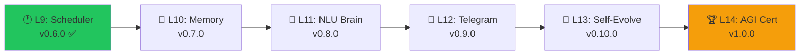

# 🦞 Tôm Hùm AGI Roadmap — Levels 10-14

> **Date:** 2026-02-08
> **Current:** v0.6.0 | Level 9 | 215 tests | 4,039 LOC (core)
> **Target:** v1.0.0 | Level 14 | 350+ tests | ~7,000 LOC (core) | **AGI Certification**

## Tổng quan: Từ "Scheduler" → "AGI thực thụ"



| Level  | Tên                | AGI Capability            | Thời gian ước tính |
| ------ | ------------------ | ------------------------- | ------------------ |
| **10** | Memory & Learning  | Nhớ quá khứ, học từ lỗi   | ~15 min            |
| **11** | NLU Brain          | Hiểu ý muốn con người     | ~15 min            |
| **12** | Telegram Commander | Điều khiển từ xa qua chat | ~20 min            |
| **13** | Self-Evolution     | Tự tạo recipe mới         | ~15 min            |
| **14** | AGI Certification  | Loop tự trị hoàn toàn     | ~15 min            |

---

## Level 10 — "Memory & Learning" 🧠

**DNA:** Passive Executor → Learning Agent

**Rational:** Hiện tại Tôm Hùm "mất trí nhớ" sau mỗi lần chạy. Level 10 cho nó bộ nhớ dài hạn — nhớ goal nào đã chạy, thành công hay thất bại, và tự rút kinh nghiệm.

### Tasks:

#### 1. Memory Store (`src/core/memory.py` ~150 lines)

- `MemoryEntry` dataclass: `goal`, `status`, `timestamp`, `duration_ms`, `error_summary`, `recipe_used`
- `MemoryStore` class:
  - `record(entry)` — Ghi lại execution
  - `query(goal_pattern)` — Tìm kiếm theo pattern
  - `get_success_rate(goal_pattern)` — Tỷ lệ thành công
  - `get_last_failure(goal_pattern)` — Lỗi gần nhất
  - `suggest_fix(goal)` — Dựa trên history, gợi ý fix
- Persistence: `.mekong/memory.yaml` (tối đa 500 entries, FIFO)
- Auto-record: Hook vào `orchestrator.run_from_goal()` kết quả

#### 2. Learning Engine (`src/core/learner.py` ~100 lines)

- `PatternAnalyzer`:
  - Phân tích failure patterns (cùng goal fail nhiều lần → đề xuất khác)
  - Success rate tracking per recipe
  - Time-of-day optimization (goal X chạy lúc 8am thành công hơn 2am)
- EventBus integration: Emit `MEMORY_RECORDED`, `PATTERN_DETECTED`

#### 3. Gateway endpoints:

- `GET /memory/recent` — 20 recent executions
- `GET /memory/stats` — Success rate, total runs, top goals
- `GET /memory/search?q=deploy` — Search history

#### 4. Dashboard "Memory" panel (in existing tabs or new)

- Recent execution history with ✅/❌ status
- Success rate chart (text-based)

#### 5. CLI: `mekong memory list`, `mekong memory stats`, `mekong memory clear`

#### 6. Version bump to v0.7.0, Tests: target 235+

---

## Level 11 — "NLU Brain" 💬

**DNA:** Command Parser → Intent Understander

**Rational:** Hiện tại goal là string thô. Level 11 thêm "bộ não ngôn ngữ" — phân loại intent, extract entities, và map goal sang recipe chính xác nhất.

### Tasks:

#### 1. Intent Classifier (`src/core/nlu.py` ~120 lines)

- `IntentResult` dataclass: `intent`, `confidence`, `entities`, `suggested_recipe`
- Built-in intents (không cần LLM cho basic):
  - `DEPLOY` — "deploy", "triển khai", "ship", "push"
  - `AUDIT` — "audit", "kiểm tra", "check", "scan"
  - `CREATE` — "tạo", "create", "new", "init"
  - `FIX` — "fix", "sửa", "repair", "debug"
  - `STATUS` — "status", "health", "trạng thái"
  - `SCHEDULE` — "schedule", "lên lịch", "every", "daily"
- Keyword-based + regex matching (fast, no API needed)
- Vietnamese support: Mapping VN keywords → intents
- Fallback to LLM for complex/ambiguous goals

#### 2. Entity Extractor:

- Extract project names: "deploy **sophia**" → project=sophia
- Extract time: "run audit **every 10 mins**" → interval=10m
- Extract targets: "check health of **node-1**" → node_id=node-1

#### 3. Smart Router (`src/core/smart_router.py` ~80 lines)

- Map intent+entities → best recipe or direct action
- Priority: Exact recipe match > Intent match > LLM fallback
- Integration with `MemoryStore`: "This goal failed 3x with recipe A, try recipe B"

#### 4. Gateway: `POST /nlu/parse` — Parse goal into intent + entities

#### 5. Orchestrator integration: `run_from_goal()` uses NLU before planning

#### 6. Version v0.8.0, Tests: target 260+

---

## Level 12 — "Telegram Commander" 📱

**DNA:** Local Dashboard → Remote Command Center

**Rational:** Đây là "Lớp Ra Lệnh" trong openclaw-concept.md. Anh chat Telegram, Tôm Hùm tự thực thi. Hoàn thành vision "Cloud Ra Lệnh + Local Thực Thi".

### Tasks:

#### 1. Telegram Bot (`src/core/telegram_bot.py` ~200 lines)

- `python-telegram-bot` library
- Commands:
  - `/cmd <goal>` — Execute a goal (calls orchestrator)
  - `/status` — System health + running jobs
  - `/schedule list` — View scheduled jobs
  - `/schedule add <goal> --every <interval>` — Add job
  - `/swarm` — Swarm node status
  - `/memory` — Recent 5 executions
  - `/help` — Command list
- Real-time progress: Send step-by-step updates as Telegram messages
- Inline keyboard buttons for common actions (Quick Deploy, etc.)
- Config: `MEKONG_TELEGRAM_TOKEN` env var + `.mekong/telegram.yaml`

#### 2. Notification Service (`src/core/notifier.py` ~80 lines)

- EventBus subscriber: Listen to `GOAL_COMPLETED`, `JOB_STARTED`, `JOB_COMPLETED`
- Push notifications to Telegram on important events
- Configurable: Which events to notify (`.mekong/notify.yaml`)

#### 3. Gateway integration:

- Start bot on gateway startup (if token configured)
- `GET /telegram/status` — Bot connection status

#### 4. CLI: `mekong telegram start`, `mekong telegram status`

#### 5. Version v0.9.0, Tests: target 285+

---

## Level 13 — "Self-Evolution" 🧬

**DNA:** Recipe Consumer → Recipe Creator

**Rational:** AGI thực thụ phải **tự học**. Level 13 cho Tôm Hùm khả năng phân tích thành công, tự tạo recipe mới, và cải thiện bản thân.

### Tasks:

#### 1. Recipe Generator (`src/core/recipe_gen.py` ~150 lines)

- `RecipeGenerator` class:
  - `from_successful_run(memory_entry)` — Biến execution thành recipe
  - `from_goal_pattern(goal, steps)` — LLM generates recipe from goal
  - `validate_recipe(recipe_md)` — Validate recipe structure
  - `save_recipe(recipe_md, name)` — Save to `recipes/auto/`
- Template system: Standard recipe structure with variables
- Auto-tagging: `display: one-button` for simple recipes

#### 2. Self-Improvement Loop (`src/core/self_improve.py` ~100 lines)

- `SelfImprover`:
  - Analyze failures → suggest new skills/recipes
  - Track recipe effectiveness → deprecate bad recipes
  - "Learning Journal": `.mekong/journal.yaml` tracking evolution
- EventBus: `RECIPE_GENERATED`, `RECIPE_DEPRECATED`

#### 3. Gateway:

- `POST /recipes/generate` — Generate recipe from goal
- `GET /recipes/auto` — List auto-generated recipes
- `POST /recipes/validate` — Validate recipe structure

#### 4. Dashboard: "Evolution" section showing learning progress

#### 5. CLI: `mekong evolve`, `mekong recipes auto-list`

#### 6. Version v0.10.0, Tests: target 310+

---

## Level 14 — "AGI Certification" 🏆

**DNA:** All Systems → **Hợp Nhất Tự Trị (Autonomous Unity)**

**Rational:** Level cuối. Kết nối tất cả thành 1 vòng lặp tự trị hoàn toàn. Tôm Hùm tự nhận goal, tự hiểu, tự lên kế hoạch, tự thực thi, tự học, tự cải thiện — KHÔNG CẦN CON NGƯỜI.

### Tasks:

#### 1. Autonomous Loop (`src/core/autonomous.py` ~120 lines)

- `AutonomousEngine`:
  - Tích hợp: NLU → Memory → Smart Router → Orchestrator → Learner → Recipe Gen
  - Mode "Auto": Scheduler fires goal → NLU parses → Router picks recipe → Orchestrator executes → Memory records → Learner analyzes → Recipe Gen improves
  - Safety: Max retries, kill switch, human-approval for destructive actions
  - "Consciousness Score": Metric tracking autonomy level (0-100)

#### 2. Governance Layer (`src/core/governance.py` ~80 lines)

- Actions classified: `safe`, `review_required`, `forbidden`
- Destructive actions (delete, drop DB) → require human approval via Telegram
- Audit trail: Every autonomous action logged
- Kill switch: `mekong halt` stops all autonomous operations

#### 3. AGI Dashboard:

- "Consciousness" tab: Real-time autonomy metrics
- Full lifecycle visualization: Goal → Intent → Plan → Execute → Learn → Evolve
- Health indicators for all subsystems

#### 4. AGI Test Suite:

- End-to-end autonomous loop test
- Safety boundary tests (can't delete without approval)
- Learning effectiveness tests (does it get better over time?)

#### 5. Version **v1.0.0** — TÔM HÙM AGI, Tests: **350+**

---

## Architecture Tổng Thể v1.0.0

```
                    ┌─────────────────────────┐
                    │    TELEGRAM / WEB UI     │
                    │   "Cloud Ra Lệnh"       │
                    └────────────┬────────────┘
                                 │
                    ┌────────────▼────────────┐
                    │     NLU Brain (L11)      │
                    │  Intent + Entity Parse   │
                    └────────────┬────────────┘
                                 │
              ┌──────────────────▼──────────────────┐
              │         Smart Router (L11)           │
              │  Memory-aware recipe selection       │
              └──────────┬──────────┬───────────────┘
                         │          │
          ┌──────────────▼┐    ┌───▼──────────────┐
          │  Orchestrator  │    │  Swarm Dispatch   │
          │  Local Execute │    │  Remote Execute   │
          └──────┬────────┘    └────────┬──────────┘
                 │                      │
          ┌──────▼────────────────────▼──────┐
          │         Memory Store (L10)         │
          │   Record → Analyze → Learn         │
          └──────────────┬─────────────────────┘
                         │
          ┌──────────────▼─────────────────────┐
          │       Self-Evolution (L13)          │
          │  Auto-generate recipes + improve    │
          └──────────────┬─────────────────────┘
                         │
          ┌──────────────▼─────────────────────┐
          │      Autonomous Loop (L14)          │
          │  Scheduler → NLU → Execute → Learn  │
          │       + Governance Safety            │
          └────────────────────────────────────┘
```

## Verification Plan

### Automated Tests

- Each level targets 25+ new tests
- `python3 -m pytest tests/ -v --tb=short` after each level
- Final target: 350+ tests for v1.0.0

### Manual Verification

- **L10**: Check `.mekong/memory.yaml` after multiple runs
- **L11**: Test Vietnamese goals are correctly classified
- **L12**: Send Telegram commands, verify real-time responses
- **L13**: Run goal 3x, verify auto-recipe generated in `recipes/auto/`
- **L14**: Set up full autonomous loop, observe 10-minute self-run cycle

## Execution Plan cho Ngày Mai

> [!IMPORTANT]
> Mỗi level ~15-20 phút với CC CLI. Tổng ~1.5 giờ cho cả 5 levels.
> **Khuyến nghị:** Chạy liên tiếp 5 levels trong 1 session sáng.

```bash
# Session sáng (ước tính 9:00 - 10:30)
/binh-phap implement: Level 10 — Memory & Learning
# verify → commit → push

/binh-phap implement: Level 11 — NLU Brain
# verify → commit → push

/binh-phap implement: Level 12 — Telegram Commander
# verify → commit → push

/binh-phap implement: Level 13 — Self-Evolution
# verify → commit → push

/binh-phap implement: Level 14 — AGI Certification (v1.0.0)
# verify → commit → push → 🎉
```
