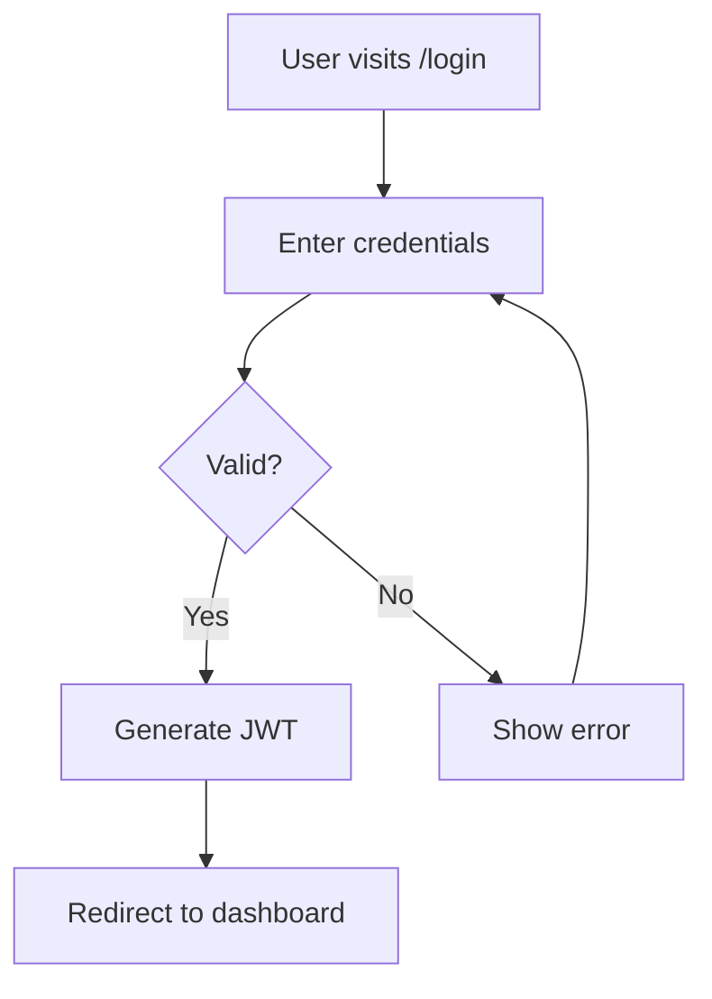

// turbo

# /mermaid - Diagram Generator

Generate Mermaid diagrams for documentation.

## Usage

```
/mermaid [type] [description]
/mermaid flowchart "user login flow"
/mermaid er "database schema"
/mermaid sequence "API call"
```

## Types

- `flowchart` - Process flows
- `sequence` - Sequence diagrams
- `er` - Entity relationship
- `class` - Class diagrams
- `state` - State machines
- `gantt` - Timeline/Gantt

## Claude Prompt Template

````
Mermaid generation workflow:

1. Analyze input:
   - Type of diagram needed
   - Key elements to include
   - Relationships

2. Generate Mermaid syntax:
   ```mermaid
   flowchart TD
       A[Start] --> B{Decision}
       B -->|Yes| C[Action 1]
       B -->|No| D[Action 2]
````

3. Validate syntax:
    - Check for syntax errors
    - Ensure proper escaping

4. Save to file or display inline

Output can be embedded in markdown.

```

## Example Output
```

📊 Mermaid: User Login Flow



✅ Diagram generated
📁 Saved: docs/diagrams/login-flow.md

```

```
