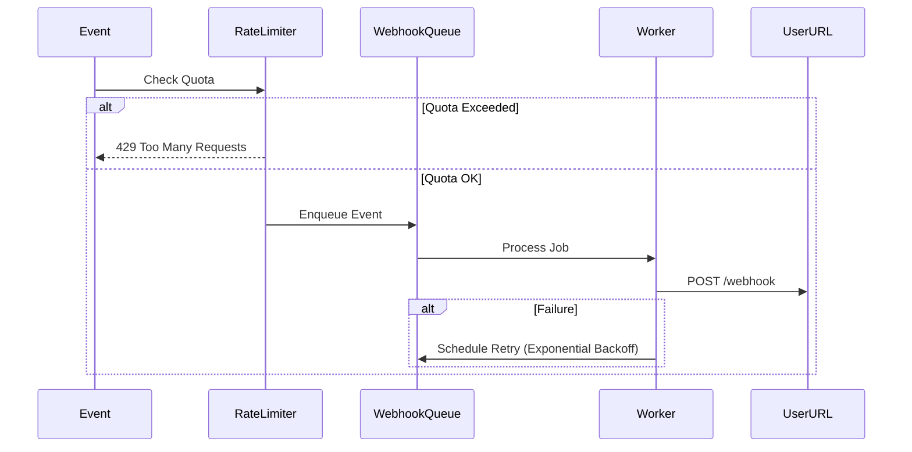

# Webhooks + Rate Limiting Pattern 🛡️

*Note: The Webhook Manager and API Rate Limiter kits are coming soon. This guide explains how to integrate them once released.*

## The Challenge

When you send webhooks to users, you need to ensure:
1.  **Reliability:** If the user's server is down, you retry.
2.  **Safety:** You don't flood their server (or yours) with too many requests.

## The Solution

We combine a **Queue** (from Webhook Kit) with a **Rate Limiter** (from Rate Limiter Kit).

### Architecture



### Implementation Logic

```typescript
import { RateLimiter } from 'antigravity-rate-limiter';
import { WebhookManager } from 'antigravity-webhook-manager';

const limiter = new RateLimiter({ redis: redisClient });
const webhooks = new WebhookManager({ redis: redisClient });

async function triggerEvent(userId: string, event: string, payload: any) {
  // 1. Check Rate Limit (e.g., 100 events per minute)
  const allowed = await limiter.checkLimit(`webhooks:${userId}`, 100, '1m');

  if (!allowed) {
    console.warn(`User ${userId} rate limited for webhooks`);
    return;
  }

  // 2. Dispatch Webhook
  await webhooks.dispatch({
    userId,
    event,
    payload,
    url: await getUserWebhookUrl(userId)
  });
}
```

## Best Practices

1.  **Idempotency:** Ensure your users can handle receiving the same webhook twice.
2.  **Signatures:** Always sign your webhooks so users can verify they came from you.
3.  **Timeouts:** Set a short timeout (e.g., 5s) for webhook requests to avoid clogging your workers.
