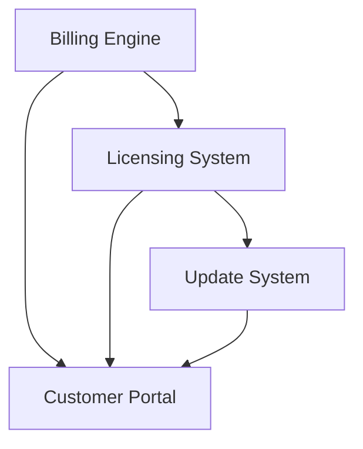

# Subscription Wrapper Implementation Plan (Phase 2)

> **Goal**: Build robust recurring revenue infrastructure including billing, licensing, updates, and customer portal.

## Strategic Context
- **Plan**: `binh-phap-balanced-production.md`
- **Objective**: Transition from one-time sales to recurring revenue (MRR).
- **Pricing**: Starter ($9), Pro ($19), Agency ($49).

## Architecture Overview
Four core modules working in concert:
1.  **Billing**: Stripe & Paddle adapters for payment processing.
2.  **Licensing**: Secure key generation, activation, and seat management.
3.  **Updates**: Automated version checking and changelog delivery.
4.  **Portal**: Self-serve customer dashboard (MD3 React components).

## Phases & Status

| Phase | Focus | Status | Dependencies |
|-------|-------|--------|--------------|
| **01** | [Foundation & Setup](./phase-01-foundation.md) | 🔴 Todo | None |
| **02** | [Billing Engine](./phase-02-billing-engine.md) | 🔴 Todo | Phase 01 |
| **03** | [Licensing System](./phase-03-licensing-system.md) | 🔴 Todo | Phase 02 |
| **04** | [Update System](./phase-04-update-system.md) | 🔴 Todo | Phase 03 |
| **05** | [Customer Portal](./phase-05-customer-portal.md) | 🔴 Todo | Phase 02, 03 |
| **06** | [Integration & Testing](./phase-06-integration-testing.md) | 🔴 Todo | All Phases |

## Dependency Map

## Risk Assessment
1.  **Security**: License key cracking.
    *   *Mitigation*: Server-side validation, periodic re-checks, strong checksums.
2.  **Vendor Lock-in**: Stripe/Paddle API changes.
    *   *Mitigation*: Abstract `BillingAdapter` interface to swap providers easily.
3.  **Update Integrity**: Corrupted updates.
    *   *Mitigation*: Checksum verification for update artifacts.

## Testing Strategy
- **Unit**: 100% coverage for Key Generator, Seat Manager, Version Checker.
- **Integration**: Mock Stripe/Paddle APIs for billing flows.
- **E2E**: Simulate full user journey: Buy -> Activate -> Update.
