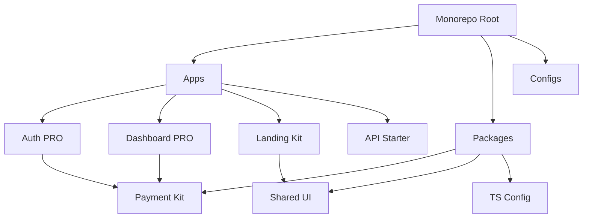

# 🏛 Architecture Overview

This document explains the high-level architecture of the Antigravity SaaS Starter Kit Bundle and how the different components interact within the monorepo.

## 🔭 Monorepo Structure

We use **Turborepo** to manage the workspace. This allows us to handle multiple applications and shared packages in a single repository.

## 🧩 Components

### 1. Applications (`apps/`)

These are the deployable units of your bundle.

*   **`apps/landing` (Next.js)**:
    *   **Role**: The public face of your SaaS.
    *   **Tech**: Next.js 14, Tailwind CSS.
    *   **Key Features**: SEO optimized, conversion focused, connects to Auth for login/signup.

*   **`apps/auth` (Next.js)**:
    *   **Role**: Handles user identity and access management.
    *   **Tech**: NextAuth.js or Supabase Auth.
    *   **Key Features**: Login, Registration, Password Reset, MFA, SSO.
    *   **Integration**: Issues JWTs or session cookies used by other apps.

*   **`apps/dashboard` (Next.js)**:
    *   **Role**: The core product application where logged-in users interact.
    *   **Tech**: Next.js 14 (App Router), TanStack Query, Radix UI.
    *   **Key Features**: Protected routes, data visualization, user settings.
    *   **Integration**: Consumes the API and verifies Auth sessions.

*   **`apps/api` (Node/Express)**:
    *   **Role**: The backend logic and data layer.
    *   **Tech**: Express.js, Prisma ORM, PostgreSQL, Redis.
    *   **Key Features**: REST endpoints, background jobs, webhooks.
    *   **Integration**: Connects to the database and Redis cache.

### 2. Shared Packages (`packages/`)

These are libraries shared across applications to ensure consistency and DRY (Don't Repeat Yourself) code.

*   **`packages/payment-integration`**:
    *   Contains shared Stripe logic, webhook handlers, and pricing UI components.
    *   Imported by `landing` (for pricing pages) and `dashboard` (for billing settings).

### 3. Infrastructure (`docker-compose.yml`)

We provide a Docker Compose configuration for local development orchestration.

*   **PostgreSQL**: Primary relational database.
*   **Redis**: Key-value store for caching and session management.

## 🔄 Data Flow

### Authentication Flow
1.  User lands on `apps/landing`.
2.  Clicks "Login" -> Redirects to `apps/auth`.
3.  User authenticates.
4.  `apps/auth` sets a secure session cookie or issues a JWT.
5.  User redirected to `apps/dashboard`.
6.  `apps/dashboard` middleware verifies the session token.

### API Request Flow
1.  `apps/dashboard` makes a request to `apps/api`.
2.  Request includes the Auth Token in headers.
3.  `apps/api` middleware validates the token using the shared secret.
4.  `apps/api` queries PostgreSQL via Prisma.
5.  `apps/api` returns JSON response.

### Payment Flow
1.  User selects a plan in `apps/landing` or `apps/dashboard`.
2.  `packages/payment-integration` initiates a Stripe Checkout session.
3.  User completes payment on Stripe.
4.  Stripe sends a webhook to `apps/api` (or `apps/auth` depending on config).
5.  Webhook handler updates the User's subscription status in PostgreSQL.

## 🛡 Security Architecture

*   **JWT / Sessions**: Centralized authentication prevents disparate logic.
*   **Environment Variables**: All secrets are managed via `.env` files (never committed).
*   **CORS**: Configured in `apps/api` to only allow requests from known frontend domains.
*   **Rate Limiting**: Implemented in `apps/api` using Redis to prevent abuse.
